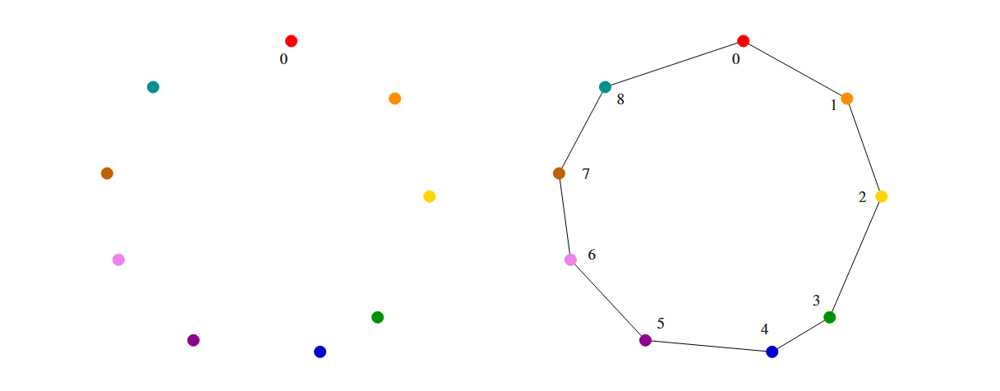
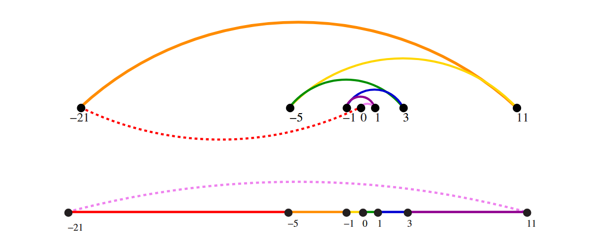
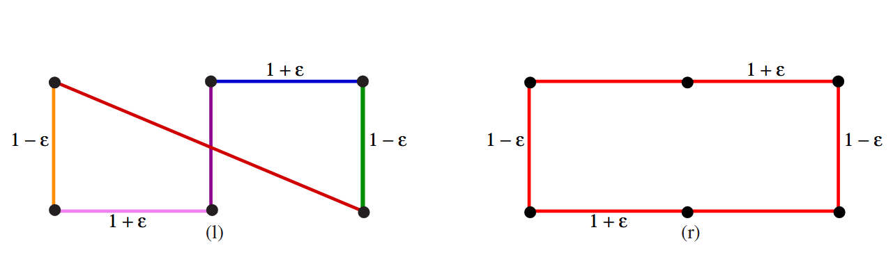

# Robot Tour Optimization

## Problem Definition

The robot tour optimization problem asks: given a robot arm that must solder contact points on a circuit board, what is the shortest path that visits each point exactly once and returns to the start?

**Formal Statement:**
- **Input:** A set *S* of *n* points in the plane
- **Output:** The shortest cycle tour that visits each point in *S*

This is a concrete instance of the **Traveling Salesman Problem (TSP)**, one of the most famous problems in computer science.

## The Nearest-Neighbor Heuristic

A natural approach is to always move to the closest unvisited point:

```
NearestNeighbor(P)
    Pick and visit an initial point p₀ from P
    p = p₀
    i = 0
    While there are still unvisited points
        i = i + 1
        Select pᵢ to be the closest unvisited point to pᵢ₋₁
        Visit pᵢ
    Return to p₀ from pₙ₋₁
```

This heuristic is simple, intuitive, and works well on some instances:




**Skiena Figure 1.2:** The nearest-neighbor heuristic produces an optimal tour when points are arranged favorably. Colors show the order of visits.


### Why Nearest-Neighbor Fails

Despite its appeal, this heuristic can produce arbitrarily bad solutions. Consider points arranged on a line:




**Skiena Figure 1.3:** Starting from point 0, the nearest-neighbor rule can jump back and forth across the center, while the optimal tour simply traverses left to right.


The algorithm finds *a* tour, but not necessarily the *shortest* tour—and no choice of starting point fixes this.

## The Closest-Pair Heuristic

A second approach repeatedly connects the closest pair of endpoints that won't create a problem:

```
ClosestPair(P)
    Let n be the number of points in set P
    For i = 1 to n − 1 do
        d = ∞
        For each pair of endpoints (s,t) from distinct vertex chains
            if dist(s,t) ≤ d then sₘ = s, tₘ = t, and d = dist(s,t)
        Connect (sₘ,tₘ) by an edge
    Connect the two endpoints by an edge
```

This fixes the linear case—but also fails on other inputs:




**Skiena Figure 1.4:** With two rows of points where vertical distance (1−ε) is slightly less than horizontal distance (1+ε), the closest-pair heuristic connects points across the gap first, producing a tour over 20% longer than optimal.


## The Brute-Force Solution

We could enumerate all *n!* permutations and select the shortest:

```
OptimalTSP(P)
    d = ∞
    For each of the n! permutations Pᵢ of point set P
        If cost(Pᵢ) ≤ d then d = cost(Pᵢ) and Pₘᵢₙ = Pᵢ
    Return Pₘᵢₙ
```

This is **correct** but **hopelessly slow**. For 20 points, there are over 2.4 × 10¹⁸ orderings. For realistic inputs (n ≈ 1000), this approach is completely infeasible.

## Algorithms vs. Heuristics


**Take-Home Lesson:** There is a fundamental difference between **algorithms**, which always produce a correct result, and **heuristics**, which may usually work well but provide no guarantee of correctness.


The robot tour problem illustrates three core challenges in algorithm design:

1. **Correctness:** Many plausible approaches produce incorrect results
2. **Efficiency:** The only guaranteed correct approach is too slow to use
3. **Trade-offs:** We must balance correctness, speed, and solution quality

These tensions appear throughout algorithm design and define much of the discipline.


The traveling salesman problem remains unsolved in the sense that no efficient algorithm is known that guarantees optimal solutions for all instances. See Section 19.4 (page 594) for further discussion.
