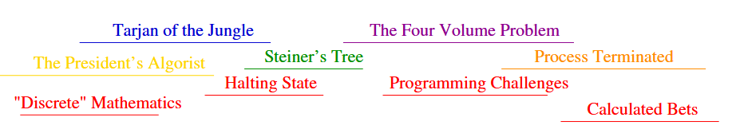

# Selecting the Right Jobs

## Problem Definition

A scheduling problem: you're an actor offered roles in *n* different films, each specified by a start and end date. You can only work on one film at a time, and each film pays the same amount. Which films should you accept to maximize your total number of jobs?

**Formal Statement:**
- **Input:** A set *I* of *n* intervals on the line
- **Output:** The largest subset of mutually non-overlapping intervals from *I*




**Skiena Figure 1.5:** An instance with 8 film offers. The optimal solution (shown in red) accepts 4 films: "Discrete" Mathematics, Programming Challenges, Calculated Bets, and Steiner's Tree.


## Failed Heuristics

### Earliest Start Time First

Accept jobs in order of their start dates:
```
EarliestJobFirst(I)
    Accept the earliest starting job j from I that does not overlap
    any previously accepted job, and repeat until no more such jobs remain
```

**Why it fails:** A long early job can block many later opportunities.

### Shortest Job First

Always accept the shortest available job:
```
ShortestJobFirst(I)
    While I ≠ ∅ do  //While list is not empty
        Accept the shortest possible job j from I
        Delete j and any interval that intersects j from I
```

**Why it fails:** One short job can block two longer jobs that would otherwise fit.



**Skiena Figure 1.6:** (Left) "War and Peace" is both earliest and longest, blocking all other jobs. (Right) The shortest job blocks two non-overlapping alternatives. Optimal solutions shown in red.


## Exhaustive Search

We could try all 2ⁿ possible subsets:
```
ExhaustiveScheduling(I)
    j = 0
    Sₘₐₓ = ∅
    For each of the 2ⁿ subsets Sᵢ of intervals I
        If (Sᵢ is mutually non-overlapping) and (size(Sᵢ) > j)
            then j = size(Sᵢ) and Sₘₐₓ = Sᵢ
    Return Sₘₐₓ
```

This is correct but still impractical. While 2²⁰ ≈ 1 million is manageable, 2¹⁰⁰ is astronomically large—far beyond any computer's reach.

## The Optimal Algorithm

The key insight: consider the job that **finishes earliest**. Any overlapping jobs must conflict with each other, so we can pick at most one from this group. Since the earliest-finishing job blocks the least future time, we should always accept it.
```
OptimalScheduling(I)
    While I ≠ ∅ do
        Accept the job j from I with the earliest completion date
        Delete j and any interval which intersects j from I
```


This algorithm is both **correct** and **efficient**. It guarantees the optimal solution and runs in polynomial time.


## Why This Algorithm Works

The earliest-finishing job never blocks more opportunities than any overlapping alternative. By accepting it, we maximize the remaining time available for future jobs. This greedy choice is provably optimal at every step.

## Key Insight

Unlike the traveling salesman problem, the movie scheduling problem *has* an efficient optimal algorithm. The difference lies in problem structure: some problems admit clever solutions that are both fast and correct, while others do not.


**Take-Home Lesson:** Reasonable-looking algorithms can easily be incorrect. Algorithm correctness is a property that must be carefully demonstrated.


Finding the right algorithm often requires:
1. Trying multiple approaches
2. Constructing counterexamples to reject incorrect heuristics
3. Identifying key problem properties that enable optimal solutions
4. Proving correctness rigorously

The contrast between sections 1.1 and 1.2 illustrates a fundamental divide in computer science: some problems are tractable (like interval scheduling), while others remain computationally intractable (like TSP).