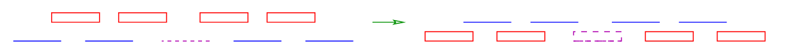

# Induction and Recursion

## Why Proofs Matter

Just because an algorithm appears to work does **not** mean it is correct.  
Failing to find a counterexample is not a proof.

In algorithm design, correctness must be **demonstrated**, not assumed. One of the most common tools for doing this is **mathematical induction**.

This section explains why induction works, why it feels strange at first, and how it connects directly to **recursive algorithms**.

## Mathematical Induction (The Big Idea)

Mathematical induction is a proof technique used to show that a statement is true for **all values of \( n \)**.

It has two essential parts:

1. **Base case**  
   Show the statement is true for a small, simple value of \( n \)

2. **Inductive step**  
   Assume the statement is true for \( n - 1 \), then prove it must also be true for \( n \)

At first, this feels like cheating:  
“How can we assume something is true before proving it?”

The key idea is that **you are not assuming the final result**, only that the problem already works for smaller cases.

## Recursion Is Induction in Code

Recursion often feels just as mysterious as induction when first encountered.

A recursive algorithm works by:

1. Checking for a **base case** (simple input)
2. Solving the problem by reducing it to **smaller versions of itself**
3. Stopping when the base case is reached

This is exactly the same structure as induction.

| Mathematics | Programming |
|------------|-------------|
| Base case  | Base case   |
| Inductive step | Recursive call |
| Assumes smaller case works | Calls itself on smaller input |

Once this connection is understood, recursion stops being magic and becomes systematic.

## Inductive Proof Example: Insertion Sort

Insertion sort is an **incremental algorithm**: it builds a solution one element at a time.

We can prove its correctness using induction.

### Base Case

A single-element array is already sorted by definition.

So insertion sort is correct for an array of size 1.

### Inductive Hypothesis

Assume that after \( n - 1 \) iterations, the first \( n - 1 \) elements of the array are sorted.

### Inductive Step

Now insert the \( n \)-th element:

* Find the correct position between the existing sorted elements
* Shift larger elements one position to the right
* Insert the new element

After this step, the first \( n \) elements are sorted.

Because the algorithm works for the base case and correctly extends a sorted array by one element, it is correct for all array sizes.

## Where Induction Can Go Wrong

Inductive proofs are powerful, but they are also **easy to get subtly wrong**.

### 1. Boundary Errors

It is common to quietly assume cases that are not actually covered.

For example:
* What if the new element is smaller than all existing elements?
* What if it is larger than all of them?

If these edge cases are not handled explicitly, the proof is incomplete.

Induction only works if the base cases are truly correct and complete.

### 2. Cavalier Extension Assumptions

A more dangerous mistake is assuming that adding one item only causes a small change.

In some problems, adding a single element can completely change the optimal solution.


**Skiena Figure 1.8:** In scheduling problems, inserting one new interval can invalidate the entire previous solution. None of the previously chosen intervals may remain optimal.


This means that a naïve inductive argument can look convincing but still be wrong.

## Why This Matters for Algorithm Design

Many algorithms are either:

* **Recursive** (divide-and-conquer)
* **Incremental** (build solution step by step)

Induction is the natural tool for proving their correctness.

However, the proof must carefully account for:
* Base cases
* Edge cases
* How adding new elements affects the global solution

Ignoring these details leads to incorrect algorithms that “feel right”.

## Take-Home Lesson

Mathematical induction is usually the correct way to prove the correctness of recursive or incremental algorithms.

Recursion is not magic — it is induction expressed as code.

Understanding this connection is a major step in thinking like an algorithm designer.
