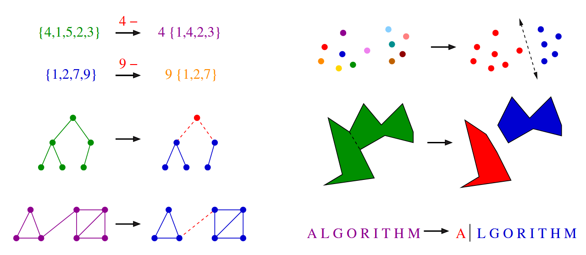

# Modeling the Problem

## Why Modeling Matters

**Modeling** is the art of translating your real-world application into a precisely-defined, well-understood problem. It's the bridge between practical problems and algorithmic solutions.


**Take-Home Lesson:** Modeling your application in terms of well-defined structures and algorithms is the most important single step towards a solution.


Good modeling can eliminate the need to design new algorithms entirely—by recognizing that someone has already solved your problem in a different context.

## The Modeling Challenge

Real-world applications involve concrete objects: network traffic, classroom schedules, database patterns. But algorithms work on abstract structures: permutations, graphs, sets.

**Your task:** Describe your problem abstractly in terms of fundamental structures.

You won't find "widget optimization" in an algorithms textbook. But once you recognize that widget optimization is really about finding the shortest path in a graph, suddenly decades of research becomes available to you.

## Fundamental Combinatorial Objects


**Skiena Figure 1.9:** Real-world structures mapped to abstract objects. (Left) A family tree as a hierarchical tree structure. (Right) A road network as a graph with cities as vertices and roads as edges.


### Common Structures and Their Triggers

**Permutations** — arrangements or orderings of items
- *Examples:* {1,4,3,2} vs {4,3,2,1}
- *Trigger words:* "arrangement," "tour," "ordering," "sequence"
- *Applications:* Robot tour optimization, sorting

**Subsets** — selections from a set (order doesn't matter)
- *Examples:* {1,3,4} and {4,3,1} are identical
- *Trigger words:* "cluster," "collection," "committee," "group," "packaging," "selection"
- *Applications:* Movie scheduling problem

**Trees** — hierarchical relationships
- *Examples:* Family trees, organization charts
- *Trigger words:* "hierarchy," "dominance relationship," "ancestor/descendant," "taxonomy"
- *Applications:* File systems, decision structures

**Graphs** — relationships between arbitrary pairs
- *Examples:* Road networks, social networks
- *Trigger words:* "network," "circuit," "web," "relationship"
- *Applications:* Route planning, network analysis

**Points** — locations in geometric space
- *Examples:* Restaurant locations on a map
- *Trigger words:* "sites," "positions," "data records," "locations"
- *Applications:* Facility location, clustering

**Polygons** — regions in geometric space
- *Examples:* Country borders, building footprints
- *Trigger words:* "shapes," "regions," "configurations," "boundaries"
- *Applications:* Geographic analysis, computer graphics

**Strings** — sequences of characters or patterns
- *Examples:* Student names, DNA sequences
- *Trigger words:* "text," "characters," "patterns," "labels"
- *Applications:* Text search, bioinformatics

### A Word of Caution

Modeling is constraining—some details won't fit perfectly into the target structure. Some problems can be modeled multiple ways, with vastly different results.

Don't be too quick to declare your problem "unique and special." Temporarily ignore details that don't fit—they might not be fundamental after all.

## Recursive Objects

**Recursion** means seeing big things as being made from smaller things *of exactly the same type*.

Think of a house as a set of rooms: add or delete a room, and you still have a house.


**Skiena Figure 1.10:** How to break down combinatorial objects recursively. (Left column) Permutations, subsets, trees, graphs. (Right column) Point sets, polygons, strings. Each structure can be decomposed into a smaller version of itself.


### How Each Structure Decomposes

**Permutations**
- Remove the first element from {4,1,5,2,3} → renumber to get {1,4,2,3}
- A permutation of *n* things becomes a permutation of *n−1* things

**Subsets**
- Remove element *n* from a subset of {1,...,*n*} → get a subset of {1,...,*n−1*}

**Trees**
- Delete the root → get a collection of smaller trees
- Delete any leaf → get a slightly smaller tree

**Graphs**
- Delete any vertex → get a smaller graph
- Divide vertices into left/right groups and cut connecting edges → get two smaller graphs

**Points**
- Draw a line through a point cloud → get two smaller clouds

**Polygons**
- Insert a chord between non-adjacent vertices → get two smaller polygons

**Strings**
- Delete the first character from "ALGORITHM" → get "LGORITHM"

### Recursion Requires Two Parts

1. **Decomposition rules:** How to break the object into smaller pieces
2. **Base cases:** Where to stop (the smallest meaningful object)

**Typical base cases:**
- Permutations/subsets: {} (empty set)
- Trees/graphs: single vertex
- Points: single point
- Polygons: triangle (smallest valid polygon)
- Strings: "" (empty string)


Whether the base case has zero or one element is a matter of taste and convenience, not fundamental principle.


---

## Why This Matters

Recursive decompositions drive many algorithms in this book. Recognizing recursive structure in a problem often leads directly to elegant algorithmic solutions.

**Keep your eyes open for recursive patterns—they're everywhere in computer science.**