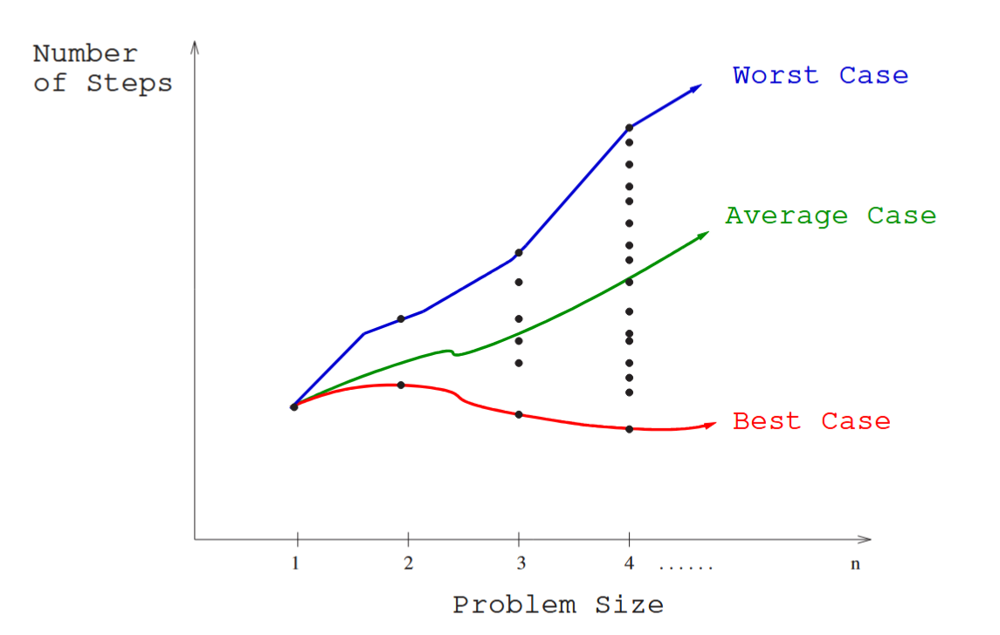
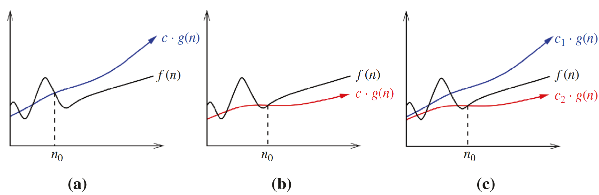
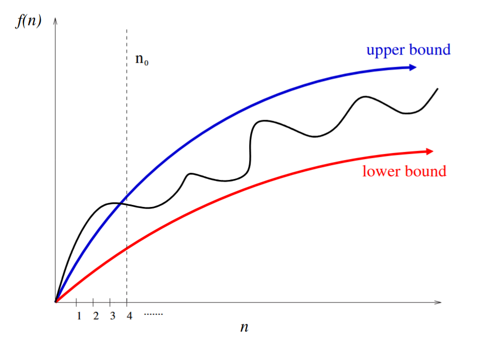

# Best, Worst, and Average-Case Complexity — and the Big Oh Notation

## Measuring an Algorithm Over All Inputs

The RAM model lets us count how many steps an algorithm takes on any specific input. But a single instance tells us very little. To understand how good or bad an algorithm truly is, we need to understand how it behaves across **all possible inputs** of every possible size.

Consider sorting. The set of valid inputs includes every possible arrangement of *n* keys, for every possible value of *n*. If we ran our algorithm on all of these and plotted the results — input size on the x-axis, steps taken on the y-axis — we would get a scatter plot where each column of points corresponds to one input size.



**Skiena Figure 2.1:** Each point represents one input instance. The three curves — worst, average, and best — summarise the behaviour of the algorithm at each input size.


From this plot, three summary functions emerge naturally:

- **Worst-case complexity** — the maximum number of steps taken over all instances of size *n*. This is the curve through the highest point in each column.
- **Best-case complexity** — the minimum number of steps taken over all instances of size *n*. This is the curve through the lowest point in each column.
- **Average-case complexity** — the average number of steps over all instances of size *n*.

## Why Worst-Case Is Usually What Matters

It might seem natural to care about average-case performance. In practice, worst-case analysis is almost always more useful.

Skiena's casino analogy captures this well. If you walk into a casino with $*n*, the best case — walking out owning the building — is so unlikely it is not worth thinking about. The worst case — losing everything — is easy to calculate and very much worth knowing. The average case is harder to define than it appears: the typical loss rate depends on how you play, how much you drink, and how lucky you are. We sidestep all of that complexity by focusing on the worst case, and we get a clean, reliable bound in return.


Average-case analysis does become important for **randomised algorithms**, where random choices are built into the algorithm itself and the expected behaviour over those choices is well-defined and meaningful.


## Why We Cannot Work With Exact Functions

Each of the three complexity measures above is, in principle, a precise numerical function of *n*. But in practice, working with exact functions is impractical for two reasons:

**Too many bumps.** Real complexity functions are irregular. Binary search, for example, runs slightly faster when the array size is exactly *2^k − 1*, because the partitions divide evenly. These fluctuations are real but unimportant — they tell us nothing useful about the algorithm's general behaviour.

**Too much detail required.** A precise worst-case expression like:
```
T(n) = 12754n² + 4353n + 834 lg²n + 13546
```

requires the algorithm to be fully specified down to individual RAM instructions, and the answer changes depending on trivial coding decisions. Yet this entire expression conveys almost exactly the same information as the much simpler observation: *the time grows quadratically with n*.

This is where the **Big Oh notation** comes in. It lets us capture the essential growth behaviour of an algorithm while discarding irrelevant detail.

## The Big Oh Notation

Big Oh notation provides a formal language for expressing upper and lower bounds on functions. It deliberately ignores constant factors, because those factors depend on implementation details — language, compiler, hardware — rather than the algorithm itself. An algorithm written in C that runs twice as fast as the same algorithm in Java is not a better algorithm; it is the same algorithm on a faster machine.

The three core definitions are:

- **f(n) = O(g(n))** means *c · g(n)* is an **upper bound** on *f(n)* for all sufficiently large *n*. There exists a constant *c* such that *f(n) ≤ c · g(n)* for all *n ≥ n₀*.
- **f(n) = Ω(g(n))** means *c · g(n)* is a **lower bound** on *f(n)* for all sufficiently large *n*. There exists a constant *c* such that *f(n) ≥ c · g(n)* for all *n ≥ n₀*.
- **f(n) = Θ(g(n))** means *g(n)* is both an upper and lower bound — a **tight bound**. There exist constants *c₁* and *c₂* such that *c₂ · g(n) ≤ f(n) ≤ c₁ · g(n)* for all *n ≥ n₀*.



**Skiena Figure 2.3:** (a) O gives an upper bound, (b) Ω gives a lower bound, (c) Θ gives a tight bound from both sides.


The threshold *n₀* in each definition is important. We are not concerned with small values of *n* — it does not matter which of two sorting algorithms is faster on six items. What matters is which is faster on ten thousand, or ten million. Big Oh lets us focus on exactly that.



**Skiena Figure 2.2:** Bounding functions smooth out the irregular behaviour of exact complexity functions, making them tractable to reason about.


## Working Through the Definitions

The best way to get comfortable with Big Oh is to work through concrete examples. Take *f(n) = 3n² − 100n + 6*:

- It is **O(n²)**, because for *c = 3*, we have *3n² > f(n)* for all *n*
- It is also **O(n³)**, because for *c = 1*, *n³ > f(n)* when *n > 3* — O gives an upper bound, not a tight one
- It is **not O(n)**, because no constant *c* keeps *cn* above *f(n)* — the quadratic term always wins eventually
- It is **Ω(n²)**, because for *c = 2*, *2n² < f(n)* when *n > 100*
- It is **not Ω(n³)**, because *f(n)* eventually falls below any constant multiple of *n³*
- It is **Θ(n²)**, because both the O and Ω bounds hold with the same *g(n) = n²*


A common trap: seeing *n² = O(n³)* and feeling like something is wrong. It is not. O gives an **upper bound**, not an exact description. *n²* is one of the many functions that are *O(n³)*. Read the "=" in Big Oh as "is one of the functions that are", not as strict equality.


## Applying the Definitions: Two Worked Examples

**Is 2^(n+1) = Θ(2^n)?**

Go back to the definitions. For the O direction: *2^(n+1) = 2 · 2^n*, so *2^(n+1) ≤ c · 2^n* holds for any *c ≥ 2*. For the Ω direction: *2^(n+1) ≥ c · 2^n* holds for any *0 < c ≤ 2*. Both bounds hold, so yes — *2^(n+1) = Θ(2^n)*.

**Is (x + y)² = O(x² + y²)?**

Expand the left side: *(x + y)² = x² + 2xy + y²*. The *2xy* term is the complication. If *x ≤ y*, then *2xy ≤ 2y² ≤ 2(x² + y²)*. If *x ≥ y*, then *2xy ≤ 2x² ≤ 2(x² + y²)*. Either way, *2xy ≤ 2(x² + y²)*, so *(x + y)² ≤ 3(x² + y²)*, and the bound holds with *c = 3*.


**The golden rule for Big Oh problems:** resist the urge to be clever. Go back to the definition, work with the inequality, and find a constant *c* that makes it hold. That is all that is ever required.
