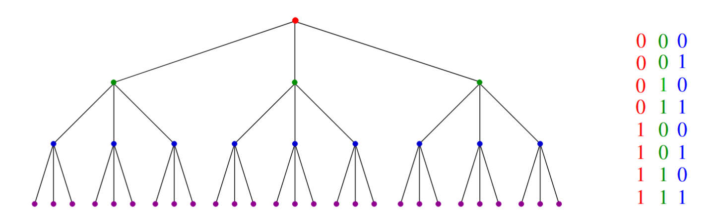

# Logarithms and Their Applications

## What Is a Logarithm?

A logarithm is simply an inverse exponential function. Saying *bˣ = y* is exactly equivalent to saying *x = log_b y*. Exponential functions grow at a ferocious rate — anyone who has watched credit card interest compound understands this intuitively. Logarithms, as their inverse, grow at a refreshingly slow rate. This slowness is precisely what makes them so valuable in algorithm design.

Logarithms appear naturally in any process where something is **repeatedly halved** or **repeatedly multiplied**. The following examples show just how many fundamental computing concepts reduce to this single idea.

## Logarithms and Binary Search

Binary search is the canonical *O(log n)* algorithm. To find a name in a telephone book containing *n* entries, you compare your target against the middle entry. Regardless of the outcome, you have eliminated exactly half the remaining candidates with a single comparison. You then repeat on the surviving half.

The number of steps equals the number of times you can halve *n* before only one entry remains — which is exactly *log₂ n* by definition. This means **twenty comparisons suffice to find any name in a million-entry list**. The power of logarithmic growth (or rather, logarithmic shrinkage) is difficult to overstate.


To appreciate why this matters, consider trying to find a name in an *unsorted* telephone book. Without the ability to discard half the entries at each step, you are back to scanning linearly — potentially a million comparisons instead of twenty.


## Logarithms and Trees

A binary tree of height 1 has at most 2 leaf nodes. A tree of height 2 has at most 4. The number of leaves doubles with each additional level, so a tree of height *h* can accommodate at most *2ʰ* leaves.

Turning this around: a binary tree with *n* leaves has height at least *log₂ n*.

Generalising to trees where each node has *d* children: the number of leaves multiplies by *d* at each level, so a tree of height *h* has at most *dʰ* leaves. To store *n* leaves requires height *h = log_d n*.

<!--  -->

**Skiena Figure 2.7:** A tree of height *h* with *d* children per node has *dʰ* leaves (left). Bit patterns of length *h* correspond to root-to-leaf paths in a binary tree of height *h* (right).


The practical consequence is that **short trees can have enormous numbers of leaves**. This is why binary trees underpin so many fast data structures — a balanced binary search tree of height 20 can index over a million entries.

## Logarithms and Bits

How many bits are needed to represent any one of *n* distinct values? Each additional bit doubles the number of representable patterns: 1 bit gives 2 patterns, 2 bits give 4, 3 bits give 8. To represent at least *n* distinct patterns we need *w* bits where *2ʷ ≥ n*, which gives *w = ⌈log₂ n⌉*.

This is why a 32-bit integer can represent roughly 4 billion values, and why adding a single bit to an address space doubles the memory that can be addressed.

## Logarithms and Multiplication

A fundamental property of logarithms is that they convert multiplication into addition:

> *log_a(xy) = log_a(x) + log_a(y)*

A direct consequence is that:

> *log_a(nᵇ) = b · log_a(n)*

This property was the basis of slide rules and logarithm tables before calculators existed. It remains useful for exponentiation: to compute *aᵇ* using only the natural exponential and logarithm functions, observe that:

> *aᵇ = exp(ln(aᵇ)) = exp(b · ln(a))*

One multiplication and two function calls replace an otherwise unwieldy computation.

## Fast Exponentiation

Computing *aⁿ* exactly — needed in cryptographic primality testing, for example — cannot rely on floating point logarithms due to precision limits. The naive approach multiplies *a* by itself *n − 1* times, taking *O(n)* multiplications.

A much better approach exploits the observation that *n = ⌊n/2⌋ + ⌈n/2⌉*:

- If *n* is even: *aⁿ = (aⁿ/²)²*
- If *n* is odd: *aⁿ = a · (aⁿ/²)²*

Each recursive call halves the exponent at a cost of at most two multiplications. The recursion therefore has depth *log₂ n*, giving **O(log n) total multiplications**.
```
function power(a, n):
    if (n = 0) return 1
    x = power(a, floor(n/2))
    if (n is even) return x²
    else return a × x²
```


This is an early example of a principle that recurs throughout the book: **divide the problem as evenly as possible**. Halving the exponent at each step is far more effective than reducing it by one. Even when *n* is not a power of two and the division is imperfect, being off by one element causes no meaningful imbalance.


## Logarithms and Summations

The Harmonic numbers are the sum of reciprocals:

> *H(n) = Σᵢ₌₁ⁿ 1/i = Θ(log n)*

This is actually a special case of the power-of-integers summation from the previous section, specifically *S(n, −1)*. The Harmonic numbers are important in algorithm analysis because they explain where a *log n* factor comes from when it appears unexpectedly in an algebraic derivation.

The average-case analysis of quicksort, for example, reduces to evaluating *n · Σᵢ₌₁ⁿ 1/i*. Recognising the Harmonic number immediately yields *Θ(n log n)* — no further manipulation needed.

## Properties of Logarithms

Several algebraic identities make logarithms easier to work with in analysis:

**Base conversion:** *log_a b = log_c b / log_c a*

This means the base of a logarithm only matters up to a constant factor. Since Big Oh discards constant factors, **the base of a logarithm is irrelevant in asymptotic analysis**. *log₂ n* and *log₁₀ n* differ only by a constant multiplier (~3.32), so both are simply *O(log n)*.

**Key identities:**
- *log_a(xy) = log_a x + log_a y*
- *log_a(x^y) = y · log_a x*
- *log_a b = 1 / log_b a*
- *a^(log_b n) = n^(log_b a)*


The base-irrelevance of logarithms in Big Oh is a point of frequent confusion. It does **not** apply to exponentials — *2ⁿ* and *3ⁿ* are fundamentally different growth rates, not related by a constant factor. The base matters enormously for exponentials but not for logarithms.


The last identity — *a^(log_b n) = n^(log_b a)* — is less obvious but appears in the analysis of divide-and-conquer algorithms. It is worth keeping in mind even if the derivation is not immediately clear.