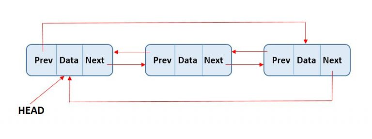

# 3.1 Contiguous vs. Linked Data Structures

Every data structure is built on one of two physical foundations: a 
**contiguous block of memory** (arrays) or **chunks of memory connected 
by pointers** (linked structures). Everything else — stacks, queues, 
trees, hash tables — is built on top of one of these two ideas.

The choice matters more than it might seem at first. The same logical 
operation (say, deleting an element) can be trivial on one and expensive 
on the other.

---

## Arrays

An array is a fixed sequence of elements stored in a single, unbroken 
block of memory. Each element sits at a predictable offset from the start, 
so the CPU can jump directly to any position given its index.

A useful mental model: think of an array as a row of numbered post office 
boxes. You know exactly where box 47 is without having to check any of the 
others first.



### Searching an Array

**Unsorted array:** You have no choice but to check each element one by 
one until you find a match — or run out of elements. This is **O(n)** in 
the worst case.

**Sorted array:** You can use binary search. Start at the middle, and 
depending on whether your target is higher or lower, discard half the 
remaining elements and repeat. This gives **O(log n)** — a dramatic 
improvement for large arrays.
```python
def binary_search(arr, target):
    low, high = 0, len(arr) - 1
    while low <= high:
        mid = (low + high) // 2
        if arr[mid] == target:
            return mid
        elif arr[mid] < target:
            low = mid + 1
        else:
            high = mid - 1
    return -1
```

Binary search is only possible because arrays give you **random access** 
— you can jump to the middle element in O(1). A linked list cannot do 
this.



### Deleting from an Array

Deletion is straightforward if you know the index, but it leaves a hole 
that needs to be dealt with.

**Unsorted array:** The cleanest solution is to overwrite the deleted 
element with the last element in the array, then decrement the length 
counter. No shifting required — this runs in **O(1)**.
```python
def delete_by_index(arr, i):
    arr[i] = arr[-1]
    arr.pop()
```

**Sorted array:** You can't use the swap trick without destroying the 
ordering. Every element after the deleted one must shift one position 
left — **O(n)** in the worst case.

The key insight is that deletion is only cheap when you don't care about 
order. As soon as sorted order matters, arrays make deletion expensive.



### Appending to an Array

Adding to the end of an array is the best-case scenario.

In Python, lists are **dynamic arrays** under the hood. When you call 
`.append()`, it adds to the end in **O(1) amortised** time. Occasionally 
the underlying array runs out of space and must be resized — Python 
allocates a new block roughly double the size and copies everything over. 
This copy is O(n), but it happens so rarely that the average cost per 
append is still constant.
```python
arr = [1, 2, 3]
arr.append(4)  # O(1) amortised
```

The word *amortised* is important here. No individual operation is 
guaranteed to be O(1) — but the total cost across n appends is O(n), 
so the average is O(1). Think of it like a bus fare: each journey is 
cheap, and occasionally you top up your card, but the average cost per 
trip stays the same.



### Inserting into an Array

Inserting at an arbitrary position is costly.

Every element from the insertion point to the end must shift one place to 
the right to make room. In the worst case — inserting at index 0 — every 
element moves. This is **O(n)**.
```python
arr = [1, 2, 4, 5]
arr.insert(2, 3)  # inserts 3 at index 2 → [1, 2, 3, 4, 5]
```

This is one of the main weaknesses of arrays. If your workload involves 
frequent insertion in the middle of a sequence, an array is the wrong 
choice.



---

## Pointers and Linked Structures

A linked list stores each element in its own separate node. Each node 
holds the data and a pointer to the next node. There is no requirement 
that nodes sit next to each other in memory — they are scattered wherever 
the allocator found space, and the pointers stitch them together.



**Figure 3.x:**  A doubly linked list where each node also holds a 
pointer back to its predecessor.



This will make a bit more sense with dictionaries in mind.



The two common variants are:

- **Singly linked:** each node points only to its successor.
- **Doubly linked:** each node points to both its successor and its 
predecessor. This costs one extra pointer per node but makes several 
operations significantly cheaper.



### Searching a Linked List

There is no shortcut here. Regardless of whether the list is sorted, you 
must start at the head and follow pointers until you find the target or 
reach the end. This is **O(n)** always.
```python
class Node:
    def __init__(self, data):
        self.data = data
        self.next = None

def search(head, target):
    current = head
    while current:
        if current.data == target:
            return current
        current = current.next
    return None
```

Sorting a linked list does offer one minor benefit: if you pass the value 
you're looking for, you can stop early. But the worst case remains O(n).

Binary search is not possible on a linked list. To reach the middle 
element you would have to traverse half the list first, which defeats 
the purpose entirely.



### Deleting from a Linked List

This is where the singly vs. doubly linked distinction really matters.

To delete a node, you need to update the pointer of the node *before* it 
so it skips over the deleted one. 

**Singly linked:** You only have a pointer to the node you want to delete, 
not to its predecessor. You have to traverse the list from the head to 
find who points to it — **O(n)**.

**Doubly linked:** Each node already holds a pointer to its predecessor. 
You can rewire the pointers immediately — **O(1)**.
```python
# Doubly linked deletion (given the node to delete)
def delete_node(node):
    if node.prev:
        node.prev.next = node.next
    if node.next:
        node.next.prev = node.prev
```

No elements shift. No memory is copied. The surrounding nodes simply 
update where they point. This is one of the most significant practical 
advantages of linked lists over arrays for certain workloads.



### Appending to a Linked List

If you maintain a pointer to the tail of the list, appending is **O(1)**. 
Allocate a new node, point the current tail at it, update the tail pointer.
```python
class LinkedList:
    def __init__(self):
        self.head = None
        self.tail = None

    def append(self, data):
        new_node = Node(data)
        if self.tail:
            self.tail.next = new_node
        else:
            self.head = new_node
        self.tail = new_node
```

Without a tail pointer, you would have to walk the entire list to find the 
end — **O(n)**. Maintaining that extra pointer is almost always worth it.



### Inserting into a Linked List

This is where linked lists genuinely shine. Once you have a pointer to 
the insertion point, rewiring two pointers is all it takes — **O(1)**.
```python
# Insert new_node after given_node
def insert_after(given_node, new_data):
    new_node = Node(new_data)
    new_node.next = given_node.next
    given_node.next = new_node
```

No elements shift. No memory is reallocated. Compare this with the O(n) 
cost of inserting into the middle of an array and you can see why linked 
lists dominate in scenarios with frequent mid-sequence insertions — 
classic examples being text editors and task schedulers.

The catch is getting to the insertion point in the first place. If you 
have to search for it, that search is O(n) regardless.



---

## Comparison

Today's computers have gigabytes of RAM, so the extra memory used by 
pointer fields in a linked list is rarely a concern in practice. What 
matters more is **time** — specifically, how the choice of structure 
affects the operations your program performs most often.

| Operation | Unsorted Array | Sorted Array | Singly Linked | Doubly Linked |
|---|---|---|---|---|
| Search | O(n) | O(log n) | O(n) | O(n) |
| Append | O(1)* | O(n) | O(1)** | O(1)** |
| Insert at position | O(n) | O(n) | O(1)*** | O(1)*** |
| Delete | O(1)* | O(n) | O(n) | O(1) |
| Access by index | O(1) | O(1) | O(n) | O(n) |

\* Amortised for dynamic arrays; requires the swap trick for deletion.  
\** Requires a tail pointer.  
\*** Given a pointer to the insertion point; finding that point is O(n).


The right question is never "which structure is faster?" but rather 
**"which operations does my program perform most, and which structure 
makes those cheapest?"** A structure that excels at search may be poor 
at insertion, and vice versa.
