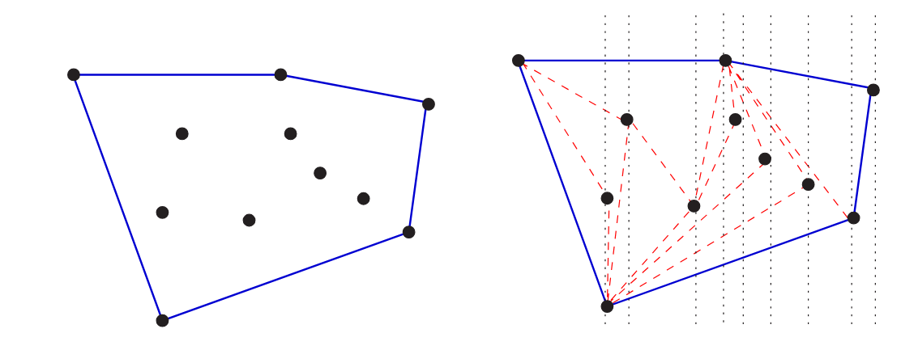

# 4.1 Applications of Sorting

The punch line of this chapter: clever sorting algorithms exist that run in **O(n log n)** — a dramatic improvement over naïve O(n²) approaches.

| n | n²/4 | n log n |
|---|---|---|
| 10 | 25 | 33 |
| 100 | 2,500 | 664 |
| 1,000 | 250,000 | 9,965 |
| 10,000 | 25,000,000 | 132,877 |
| 100,000 | 2,500,000,000 | 1,660,960 |

A quadratic algorithm may survive at n = 10,000, but becomes completely impractical beyond that. Many important problems reduce to sorting, meaning an O(n log n) algorithm can replace what might otherwise require a quadratic solution.


**Take-Home Lesson:** Sorting lies at the heart of many algorithms. Sorting the data is one of the first things any algorithm designer should try in the quest for efficiency.


## Applications



Binary search tests whether an item is in a dictionary in **O(log n)** time — but only if the keys are sorted. Search preprocessing is perhaps the single most important application of sorting.



Given n numbers, find the pair with the smallest difference. Once sorted, the closest pair must be **adjacent** in sorted order. A single linear scan after sorting solves it in **O(n log n)** total.



Are there duplicates in a set of n items? Sort the list, then do a linear scan checking adjacent pairs. This is a special case of closest pair — asking if any pair has a gap of zero.



Which element occurs most often? After sorting, identical elements are grouped together. Sweep left to right counting runs. For a specific element k, binary search can find its count in **O(log n)** by locating the positions of k − ε and k + ε.



What is the kth largest item? In a sorted array, it sits at position k — constant time lookup. The **median** specifically sits at position n/2.



What is the smallest-perimeter polygon enclosing n points in 2D? Once points are sorted by x-coordinate, they can be inserted left-to-right into the hull in linear time.


**Skiena Figure 4.1:** The convex hull of a set of points (left), constructed by left-to-rightinsertion (right).at each input size.




---

## Stop and Think: Set Intersection

**Problem:** Given two sets of size m and n (m < n), determine if they are disjoint. What is the most efficient approach?



Sort the large set in O(n log n), then binary search for each of the m elements.

**Total: O((n + m) log n)**



Sort the small set in O(m log m), then binary search for each of the n elements.

**Total: O((n + m) log m)**

Since log m < log n when m < n, this beats sorting the large set.



Sort both sets, then merge-compare in linear time — no binary search needed. Discard the smaller element if they don't match; repeat.

**Total: O(n log n + m log m + n + m)**




Sorting the small set wins asymptotically. When m is constant, this reduces to linear time. Hashing can also achieve expected linear time — build a hash table from both sets and check collisions.



Hashing is discussed in chapter 3!


---

## Stop and Think: Hashing vs. Sorting

Can hashing match or beat sorting for these problems?

| Problem | Hashing? | Notes |
|---|---|---|
| Searching | ✦ Better | O(1) expected vs O(log n) |
| Closest pair | ✗ No | Hash functions scatter keys — proximity is lost |
| Element uniqueness | ✦ Better | Linear expected time via chaining |
| Finding the mode | ✦ Equal | Linear expected time by counting within buckets |
| Finding the median | ✗ No | No way to determine rank within a hash table |
| Convex hull | ✗ No | Ordering by x-coordinate cannot be recovered from a hash |