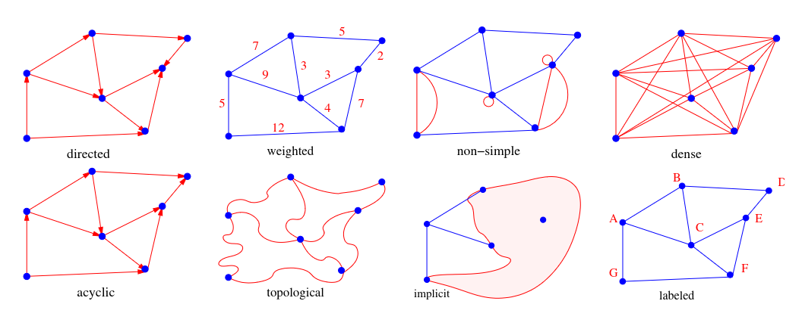
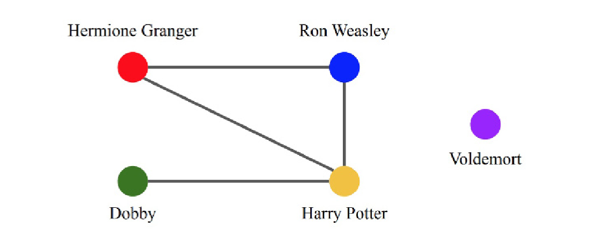

# 5.1 Flavours of Graphs

A **graph** G = (V, E) is defined on a set of vertices V and a set of edges E of ordered or unordered pairs of vertices from V. Vertices might represent cities, lines of code, or people — and edges represent whatever relationship is meaningful in context: roads, control flow, friendships.

Before choosing a data structure or algorithm, the first step in any graph problem is identifying what *kind* of graph you are dealing with. The properties below govern both representation and analysis.


**Skiena Figure 7.1:** Important properties / flavors of graphs.


---

## Undirected vs. Directed

A graph is **undirected** if the presence of edge (x, y) implies the presence of (y, x). Road networks between cities are typically undirected. A graph is **directed** (or a *digraph*) if edges have a fixed orientation — (x, y) does not imply (y, x). Program flow graphs are directed because execution moves from one line to the next in a specific direction.

---

## Weighted vs. Unweighted

In a **weighted graph**, each edge (or vertex) is assigned a numerical value. The edges of a road network might carry weights representing distance, drive time, or speed limit. In an **unweighted graph**, all edges are treated as equal.

This distinction becomes critical when finding shortest paths. For unweighted graphs, the shortest path minimises the number of edges and can be found with BFS (Section 5.2). Weighted shortest paths require more sophisticated algorithms (Chapter 6).

---

## Simple vs. Non-Simple

A **self-loop** is an edge (x, x) connecting a vertex to itself. A **multiedge** is an edge that appears more than once between the same pair of vertices. Any graph that contains neither is called **simple**. Most practical graph algorithms assume simple graphs — non-simple graphs require special handling in nearly every operation.

---

## Sparse vs. Dense

A graph is **sparse** when only a small fraction of possible vertex pairs have edges. A **dense** graph has a large fraction of possible edges present. A **complete** graph contains every possible edge; for a simple undirected graph on n vertices, that is $\binom{n}{2} = \frac{n^2 - n}{2}$ edges.

There is no strict boundary, but:

| Type | Edge count |
|------|-----------|
| Dense | Θ(n²) |
| Sparse | Θ(n) or close |

Sparse graphs are usually sparse for structural reasons. Road networks are sparse because intersections physically cannot support many roads; the most complex junction Skiena identifies connects just seven roads.

---

## Cyclic vs. Acyclic

A **cycle** is a closed path of 3 or more vertices with no repeated vertices except the start/end point. An **acyclic** graph contains no cycles.

- **Trees** are undirected, connected, acyclic graphs — the simplest interesting graphs. Cutting any edge of a tree yields two smaller trees.
- **DAGs** (directed acyclic graphs) arise naturally in scheduling, where a directed edge (x, y) means activity x must precede y. The key operation on DAGs is **topological sorting**, which orders vertices to respect these constraints (Section 5.5).

---

## Embedded vs. Topological

A graph is **topological** when only the abstract edge–vertex structure matters. It is **embedded** when vertices and edges are assigned geometric positions in space.

Sometimes geometry *defines* the graph. In the travelling salesman problem, the vertices are points in the plane and edge weights are Euclidean distances. Grid graphs are another example: the edges are implied entirely by the geometry of the grid.

---

## Implicit vs. Explicit

Some graphs are never fully constructed — they are **implicit**, built on demand as the algorithm explores them. Backtrack search is a canonical example: the vertices are search states and edges connect states reachable in one step. Web crawling is another — you explore the locally relevant portion rather than downloading the entire web upfront. Working with implicit graphs avoids storing a structure that may be too large to fit in memory.

---

## Labeled vs. Unlabeled

In a **labeled** graph, each vertex has a unique name or identifier. In an **unlabeled** graph, vertices are indistinguishable. Applications typically use labeled graphs (e.g. city names in a transport network). **Graph isomorphism** — determining whether two graphs are structurally identical ignoring labels — is a harder problem discussed later.

---

## The Friendship Graph

To ground these properties concretely, consider a graph where vertices are people and an edge between two people indicates they are friends.


**Skiena Figure 7.3:** A portion of the friendship graph from Harry Potter.


| Property | Question it answers | Answer for friendship |
|---|---|---|
| Directed vs. undirected | If I'm your friend, are you mine? | Undirected (ideally) |
| Weighted vs. unweighted | How close a friend are you? | Weighted (−100 to 100) |
| Simple vs. non-simple | Am I my own friend? | Simple — no self-loops |
| Degree | Who has the most friends? | Highest-degree vertex |
| Embedded | Do my friends live near me? | Yes — geography shapes it |
| Implicit | Can I see everyone's friendships? | Implicit — you only know your own |
| Labeled | Are you an individual or a number? | Labeled by name or ID |

The **degree** of a vertex is the number of edges adjacent to it. In a friendship graph, the most popular person corresponds to the highest-degree vertex; a hermit corresponds to a degree-zero vertex.


**Take-Home Lesson:** The properties above are not just vocabulary — they directly determine which algorithms apply and which data structures are appropriate. Misidentifying the flavour of your graph is one of the most common sources of bugs and poor performance in graph-based programs.
