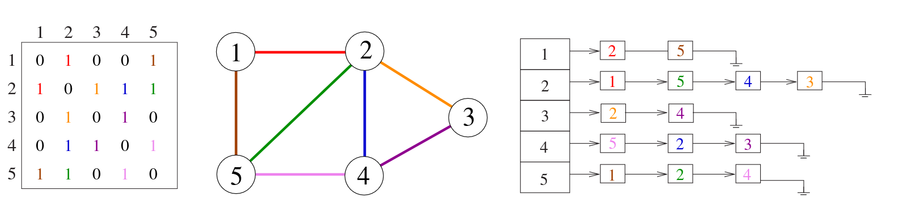

# 5.2 Data Structures for Graphs

Selecting the right graph data structure has an enormous impact on performance. The two fundamental choices are **adjacency matrices** and **adjacency lists** — already illustrated in Figure 7.4.

We assume G = (V, E) has n vertices and m edges.



**Skiena Figure 7.1:** he adjacency matrix and adjacency list representation of a givengraph. Colors encode specific edges.

---

## Adjacency Matrix

An adjacency matrix represents G as an n × n matrix M, where M[i][j] = 1 if edge (i, j) exists, and 0 otherwise. Edge queries are O(1) — simply look up the cell.

The cost is space. Consider a graph of Manhattan's street grid: roughly 3,000 vertices and 6,000 edges. An adjacency matrix would require 3,000 × 3,000 = 9,000,000 entries — almost all of them zero. Packing bits or using triangular matrices for undirected graphs saves some space, but the representation remains inherently quadratic even when the graph is sparse.

## Adjacency List

An adjacency list stores, for each vertex, a linked list of its neighbours. Total space is Θ(n + m) — proportional only to what actually exists. Most graph algorithms traverse all edges exactly once anyway, so the inability to answer "is (i, j) an edge?" in O(1) rarely matters in practice.


**Take-Home Lesson:** Adjacency lists are the right data structure for most graph problems.


The tradeoffs are summarised below:

| Operation | Winner |
|---|---|
| Test if (x, y) is in graph | Adjacency matrix — O(1) |
| Find degree of a vertex | Adjacency list |
| Memory, sparse graph | Adjacency list — Θ(m + n) vs Θ(n²) |
| Memory, dense graph | Adjacency matrix (slight win) |
| Edge insertion or deletion | Adjacency matrix — O(1) vs O(degree) |
| Full graph traversal | Adjacency list — Θ(m + n) vs Θ(n²) |
| Best for most problems | Adjacency list |

---

## Implementation

The adjacency list structure below is the one used throughout this unit. Each graph tracks its vertex count, edge count, and a flag for directedness. Neighbours of each vertex are stored as a linked list of `edgenode` structs.



```c
#define MAXV 100        /* maximum number of vertices */

typedef struct edgenode {
    int y;              /* neighbour vertex */
    int weight;         /* edge weight, if any */
    struct edgenode *next;
} edgenode;

typedef struct {
    edgenode *edges[MAXV + 1];  /* adjacency lists */
    int degree[MAXV + 1];       /* out-degree of each vertex */
    int nvertices;
    int nedges;
    int directed;
} graph;
```



```cpp
#include <vector>

struct EdgeNode {
    int y;
    int weight;
};

struct Graph {
    std::vector<std::vector<EdgeNode>> edges;
    std::vector<int> degree;
    int nvertices, nedges;
    bool directed;

    Graph(int n, bool dir)
        : edges(n + 1), degree(n + 1, 0),
          nvertices(n), nedges(0), directed(dir) {}
};
```



```python
from collections import defaultdict
from dataclasses import dataclass, field
from typing import Optional

@dataclass
class EdgeNode:
    y: int
    weight: int = 0
    next: Optional['EdgeNode'] = None

@dataclass
class Graph:
    nvertices: int
    directed: bool
    edges: dict = field(default_factory=lambda: defaultdict(lambda: None))
    degree: dict = field(default_factory=lambda: defaultdict(int))
    nedges: int = 0
```



### Initialisation



```c
void initialize_graph(graph *g, bool directed) {
    g->nvertices = 0;
    g->nedges    = 0;
    g->directed  = directed;
    for (int i = 1; i <= MAXV; i++) {
        g->degree[i] = 0;
        g->edges[i]  = NULL;
    }
}
```



```cpp
void initialize_graph(Graph &g, int n, bool directed) {
    g.nvertices = n;
    g.nedges    = 0;
    g.directed  = directed;
    g.edges.assign(n + 1, {});
    g.degree.assign(n + 1, 0);
}
```



```python
def initialize_graph(nvertices, directed):
    return Graph(nvertices=nvertices, directed=directed)
```



### Edge Insertion

New edges are inserted at the **head** of the adjacency list — order within the list does not affect correctness. For undirected graphs, each edge (x, y) is stored twice: once in x's list and once in y's list. The function calls itself recursively to handle the second copy cleanly.



```c
void insert_edge(graph *g, int x, int y, bool directed) {
    edgenode *p = malloc(sizeof(edgenode));
    p->weight   = 0;
    p->y        = y;
    p->next     = g->edges[x];
    g->edges[x] = p;
    g->degree[x]++;

    if (!directed)
        insert_edge(g, y, x, true);
    else
        g->nedges++;
}
```



```cpp
void insert_edge(Graph &g, int x, int y, bool directed, int weight = 0) {
    g.edges[x].push_back({y, weight});
    g.degree[x]++;

    if (!directed)
        insert_edge(g, y, x, true, weight);
    else
        g.nedges++;
}
```



```python
def insert_edge(g, x, y, directed, weight=0):
    node = EdgeNode(y=y, weight=weight, next=g.edges[x])
    g.edges[x] = node
    g.degree[x] += 1

    if not directed:
        insert_edge(g, y, x, True, weight)
    else:
        g.nedges += 1
```



### Reading from a File

A standard graph file begins with a line giving n (vertices) and m (edges), followed by m lines each containing a vertex pair.



```c
void read_graph(graph *g, bool directed) {
    int m, x, y;
    initialize_graph(g, directed);
    scanf("%d %d", &(g->nvertices), &m);
    for (int i = 1; i <= m; i++) {
        scanf("%d %d", &x, &y);
        insert_edge(g, x, y, directed);
    }
}
```



```cpp
void read_graph(Graph &g, bool directed) {
    int n, m, x, y;
    std::cin >> n >> m;
    initialize_graph(g, n, directed);
    for (int i = 0; i < m; i++) {
        std::cin >> x >> y;
        insert_edge(g, x, y, directed);
    }
}
```



```python
def read_graph(lines, directed):
    tokens = iter(lines.split())
    n, m = int(next(tokens)), int(next(tokens))
    g = initialize_graph(n, directed)
    for _ in range(m):
        x, y = int(next(tokens)), int(next(tokens))
        insert_edge(g, x, y, directed)
    return g
```



### Printing



```c
void print_graph(graph *g) {
    edgenode *p;
    for (int i = 1; i <= g->nvertices; i++) {
        printf("%d: ", i);
        p = g->edges[i];
        while (p != NULL) {
            printf(" %d", p->y);
            p = p->next;
        }
        printf("\n");
    }
}
```



```cpp
void print_graph(const Graph &g) {
    for (int i = 1; i <= g.nvertices; i++) {
        std::cout << i << ":";
        for (auto &e : g.edges[i])
            std::cout << " " << e.y;
        std::cout << "\n";
    }
}
```



```python
def print_graph(g):
    for i in range(1, g.nvertices + 1):
        neighbors = []
        node = g.edges[i]
        while node:
            neighbors.append(str(node.y))
            node = node.next
        print(f"{i}: {' '.join(neighbors)}")
```



---

## Building a Graph from CSV

In practice, graphs rarely come from formatted text files — they come from CSV exports of databases, pipelines, or spreadsheets. The standard edge-list CSV format is:

```
node1,node2,weight
```

Each row describes one edge. The permutations below cover the most common real-world variants.

### Variant 1 — Unweighted, Undirected

```
A,B
A,C
B,D
```

```python
import csv
from collections import defaultdict

def load_undirected_unweighted(path):
    adj = defaultdict(set)
    with open(path) as f:
        for row in csv.reader(f):
            u, v = row[0].strip(), row[1].strip()
            adj[u].add(v)
            adj[v].add(u)   # undirected: both directions
    return adj
```

### Variant 2 — Weighted, Undirected

```
A,B,4.5
A,C,2.0
B,D,1.7
```

```python
def load_undirected_weighted(path):
    adj = defaultdict(dict)
    with open(path) as f:
        for row in csv.reader(f):
            u, v, w = row[0].strip(), row[1].strip(), float(row[2])
            adj[u][v] = w
            adj[v][u] = w   # undirected
    return adj
```

### Variant 3 — Weighted, Directed

Omit the reverse insertion. Edge (u → v) exists; (v → u) does not unless explicitly listed.

```python
def load_directed_weighted(path):
    adj = defaultdict(dict)
    with open(path) as f:
        for row in csv.reader(f):
            u, v, w = row[0].strip(), row[1].strip(), float(row[2])
            adj[u][v] = w   # directed: one way only
    return adj
```

### Variant 4 — Multiple Weights per Edge

Some CSVs encode richer edge data — for example, a transport network might carry both distance and travel time on each edge.

```
A,B,4.5,12
A,C,2.0,6
B,D,1.7,4
```

```python
from dataclasses import dataclass

@dataclass
class MultiWeightEdge:
    distance: float
    time: float

def load_multi_weight(path):
    adj = defaultdict(dict)
    with open(path) as f:
        for row in csv.reader(f):
            u, v = row[0].strip(), row[1].strip()
            adj[u][v] = MultiWeightEdge(
                distance=float(row[2]),
                time=float(row[3])
            )
    return adj
```

### Variant 5 — CSV with a Header Row

Many exported CSVs include column names. Skip the header with `next()` before iterating, or use `csv.DictReader` to access columns by name regardless of order:

```python
def load_from_headed_csv(path, directed=False):
    adj = defaultdict(dict)
    with open(path) as f:
        reader = csv.DictReader(f)  # reads header automatically
        for row in reader:
            u = row['source'].strip()
            v = row['target'].strip()
            w = float(row['weight'])
            adj[u][v] = w
            if not directed:
                adj[v][u] = w
    return adj
```


**Choosing a representation:** For algorithm implementation (BFS, DFS, Dijkstra), convert your CSV adjacency dict into the `Graph` struct above. The CSV loaders above are ingestion utilities — use them to populate the canonical structure, not as a replacement for it.

```