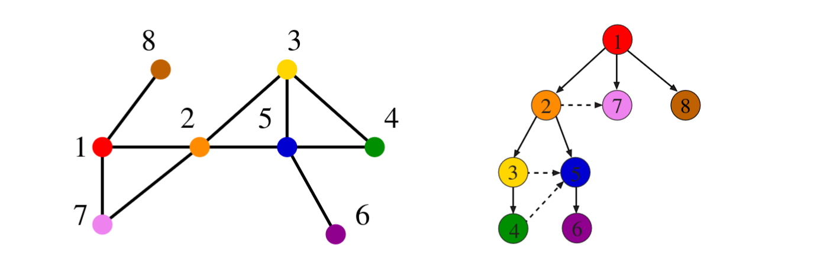

# 5.4 Breadth-First Search

Breadth-first search (BFS) is the simpler of the two fundamental graph traversal strategies. It explores the graph **level by level** — first all vertices one hop from the start, then all vertices two hops away, and so on. This layered expansion is what makes BFS the natural tool for shortest path problems on unweighted graphs.

---

## The BFS Tree

As BFS runs, it assigns a direction to each edge it uses to discover a new vertex. If vertex u discovers vertex v for the first time, u becomes the **parent** of v. Since every vertex (except the start) has exactly one parent, these parent relationships define a tree — the **BFS tree**.



**Skiena Figure 7.9:** An undirected graph (left) and its BFS tree (right). Dashed edges are non-tree edges — they connect vertices already discovered or processed, and do not appear in the tree.


The BFS tree has a critical property: the path from the root to any vertex x in the tree uses the **fewest possible edges** of any root-to-x path in the original graph. This is a direct consequence of the level-by-level expansion — a vertex at depth d can only be reached after all vertices at depth d − 1 have already been discovered.

Non-tree edges — those not used to discover a new vertex — also behave predictably in undirected graphs: they can only connect vertices on the **same level** or **adjacent levels** of the tree. If they could skip levels, BFS would have found a shorter path, contradicting the level-by-level structure.

---

## Algorithm

The pseudocode below captures the full logic. The queue Q enforces FIFO ordering — older (closer) vertices are always expanded before newer (farther) ones.

```
BFS(G, s):
  for each vertex u in V:
    state[u] = undiscovered
    parent[u] = nil

  state[s] = discovered
  Q = { s }

  while Q is not empty:
    u = dequeue(Q)
    process vertex u (early)
    for each neighbour v of u:
      process edge (u, v)
      if state[v] == undiscovered:
        state[v] = discovered
        parent[v] = u
        enqueue(Q, v)
    state[u] = processed
```

The distinction between *discovered* and *processed* matters. A vertex enters the queue the moment it is first seen (discovered), but its edges are only examined when it reaches the front of the queue (processed). In between, it sits waiting — discovered but not yet fully explored.

---

## Implementation

The implementation uses two Boolean arrays rather than a single three-state enum — a practical choice that simplifies the conditional checks in the inner loop. A `parent` array records the discovery tree.



```c
bool processed[MAXV + 1];
bool discovered[MAXV + 1];
int  parent[MAXV + 1];

void initialize_search(graph *g) {
    for (int i = 0; i <= g->nvertices; i++) {
        processed[i]  = false;
        discovered[i] = false;
        parent[i]     = -1;
    }
}

void bfs(graph *g, int start) {
    queue q;
    int v, y;
    edgenode *p;

    init_queue(&q);
    enqueue(&q, start);
    discovered[start] = true;

    while (!empty_queue(&q)) {
        v = dequeue(&q);
        process_vertex_early(v);
        processed[v] = true;

        p = g->edges[v];
        while (p != NULL) {
            y = p->y;
            if ((!processed[y]) || g->directed)
                process_edge(v, y);
            if (!discovered[y]) {
                enqueue(&q, y);
                discovered[y] = true;
                parent[y] = v;
            }
            p = p->next;
        }
        process_vertex_late(v);
    }
}
```



```cpp
#include <queue>
#include <vector>

std::vector<bool> processed, discovered;
std::vector<int>  parent;

void initialize_search(const Graph &g) {
    processed.assign(g.nvertices + 1, false);
    discovered.assign(g.nvertices + 1, false);
    parent.assign(g.nvertices + 1, -1);
}

void bfs(const Graph &g, int start) {
    std::queue<int> q;
    q.push(start);
    discovered[start] = true;

    while (!q.empty()) {
        int v = q.front(); q.pop();
        process_vertex_early(v);
        processed[v] = true;

        for (const auto &e : g.edges[v]) {
            int y = e.y;
            if (!processed[y] || g.directed)
                process_edge(v, y);
            if (!discovered[y]) {
                q.push(y);
                discovered[y] = true;
                parent[y] = v;
            }
        }
        process_vertex_late(v);
    }
}
```



```python
from collections import deque

def bfs(g, start, process_vertex_early=None,
        process_vertex_late=None, process_edge=None):
    discovered = {i: False for i in range(1, g.nvertices + 1)}
    processed  = {i: False for i in range(1, g.nvertices + 1)}
    parent     = {i: -1    for i in range(1, g.nvertices + 1)}

    queue = deque([start])
    discovered[start] = True

    while queue:
        v = queue.popleft()
        if process_vertex_early:
            process_vertex_early(v)
        processed[v] = True

        node = g.edges[v]
        while node:
            y = node.y
            if (not processed[y]) or g.directed:
                if process_edge:
                    process_edge(v, y)
            if not discovered[y]:
                queue.append(y)
                discovered[y] = True
                parent[y] = v
            node = node.next

        if process_vertex_late:
            process_vertex_late(v)

    return parent
```



---

## Customising the Traversal

The three hook functions — `process_vertex_early`, `process_vertex_late`, and `process_edge` — are the key to making BFS reusable. The traversal framework itself never changes; only these hooks do. This separation is deliberate: the traversal guarantees that every edge and vertex is visited exactly once, so any logic placed inside the hooks is also guaranteed to run exactly once per element.

Some examples of what the hooks can do:

- **Print every vertex and edge** — place `printf` calls in `process_vertex_early` and `process_edge`.
- **Count edges** — increment a counter in `process_edge`. The final count equals m for directed graphs and m/2 for undirected (since each undirected edge is seen twice, once from each endpoint — but the `processed` check in the BFS inner loop prevents double-counting).
- **Detect connected components** — run BFS from each undiscovered vertex; each fresh start indicates a new component.
- **Check bipartiteness** — colour vertices alternately as you cross each edge; a conflict reveals an odd cycle.

`process_vertex_late` fires *after* all edges of a vertex have been examined. It is a no-op in basic BFS but becomes important in DFS, where it corresponds to the moment a vertex's entire subtree has been fully explored.

---

## Finding Shortest Paths

The `parent` array produced by BFS encodes the shortest path tree rooted at the start vertex. Following parent pointers backward from any vertex x traces the shortest path from x back to the root.

We cannot follow pointers *forward* from the root because parent pointers only point toward the root — each vertex records who discovered it, not who it discovered. The solution is to let recursion reverse the path for us:



```c
void find_path(int start, int end, int parents[]) {
    if ((start == end) || (end == -1))
        printf("\n%d", start);
    else {
        find_path(start, parents[end], parents);
        printf(" %d", end);
    }
}
```



```cpp
void find_path(int start, int end, const std::vector<int> &parents) {
    if (start == end || end == -1)
        std::cout << "\n" << start;
    else {
        find_path(start, parents[end], parents);
        std::cout << " " << end;
    }
}
```



```python
def find_path(start, end, parents):
    if start == end or end == -1:
        print(start, end=' ')
    else:
        find_path(start, parents[end], parents)
        print(end, end=' ')
```



Using the BFS tree from Figure 7.9, the parent array for a search starting at vertex 1 is:

| Vertex | 1 | 2 | 3 | 4 | 5 | 6 | 7 | 8 |
|--------|---|---|---|---|---|---|---|---|
| Parent | −1 | 1 | 2 | 3 | 2 | 5 | 1 | 1 |

Following parents backward from vertex 6: 6 → 5 → 2 → 1. The shortest path is **1 → 2 → 5 → 6**.


Two conditions must hold for BFS shortest paths to be valid:

1. BFS must have been run with the **source vertex as the root**. The parent array encodes shortest paths only from that specific starting point.
2. The graph must be **unweighted**. BFS counts hops, not distances. On a weighted graph, the fewest-edge path is not necessarily the lowest-cost path — that requires Dijkstra's algorithm (Chapter 6).


---

## Complexity

BFS visits every vertex once and examines every edge once (twice for undirected graphs, but the `processed` check skips the redundant direction). Total time is **Θ(n + m)** — optimal, since reading the input itself takes that long. Space is also **Θ(n + m)**: the queue holds at most n vertices, and the adjacency list holds m edge entries.
