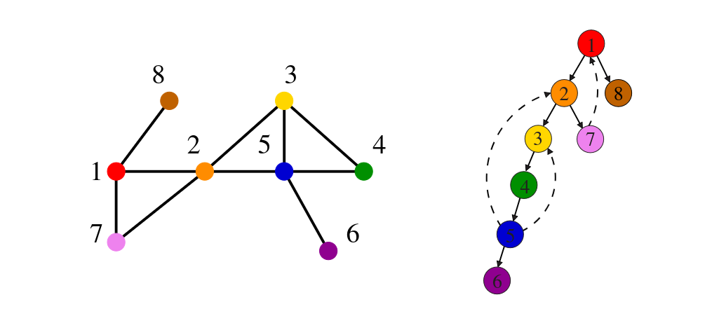

# 5.5 Depth-First Search

Depth-first search (DFS) explores a graph by going **as deep as possible** along each path before backtracking. Where BFS fans out level by level from the start, DFS plunges immediately down a single branch, only retreating when it hits a dead end.

---

## Queue vs. Stack — The Only Real Difference

In Section 5.3 we noted that the three-state vertex model is identical for both traversal strategies. The sole structural difference between BFS and DFS is the data structure used to hold discovered-but-not-yet-processed vertices:

| Structure | Order | Behaviour |
|---|---|---|
| **Queue** (FIFO) | Oldest vertices first | Radiates outward level by level — BFS |
| **Stack** (LIFO) | Newest vertices first | Plunges deep along one path — DFS |

Because DFS uses a stack, and because recursion *is* a stack, the cleanest implementation of DFS is recursive. The call stack plays the role of the explicit stack, and backtracking happens automatically when a recursive call returns.

---

## Entry and Exit Times

DFS introduces a concept that BFS does not need: a **traversal clock**. The clock increments each time we enter or exit a vertex, giving every vertex an entry time and an exit time.

These timestamps encode the structure of the DFS tree in a precise way:

- **Ancestry** — if x is an ancestor of y in the DFS tree, then x's interval properly contains y's interval. We must enter x before y (you cannot be born before your grandparent) and exit y before x (we cannot leave x until we have fully explored all its descendants).
- **Descendant count** — the number of descendants of v in the DFS tree equals half the difference between v's exit and entry times. The clock ticks once on entry and once on exit for every vertex in v's subtree.

These intervals become critical in later applications: topological sorting, and finding biconnected and strongly connected components all rely on entry/exit time reasoning.

---

## Algorithm

```
DFS(G, u):
  state[u] = discovered
  entry[u] = time++
  process vertex u (early)

  for each neighbour v of u:
    process edge (u, v)
    if state[v] == undiscovered:
      parent[v] = u
      DFS(G, v)

  state[u] = processed
  exit[u] = time++
  process vertex u (late)
```

The `process_vertex_late` hook fires *after* all descendants have been fully explored — the key difference from BFS, where late processing was trivial. In DFS, this is the moment a vertex's entire subtree is complete, which is precisely when topological ordering and component algorithms do their work.

---

## Implementation



```c
void dfs(graph *g, int v) {
    edgenode *p;
    int y;

    if (finished) return;   /* allow early termination */

    discovered[v] = true;
    entry_time[v] = ++time;
    process_vertex_early(v);

    p = g->edges[v];
    while (p != NULL) {
        y = p->y;
        if (!discovered[y]) {
            parent[y] = v;
            process_edge(v, y);
            dfs(g, y);
        } else if ((!processed[y] && parent[v] != y) || g->directed) {
            process_edge(v, y);
        }
        if (finished) return;
        p = p->next;
    }

    process_vertex_late(v);
    exit_time[v] = ++time;
    processed[v] = true;
}
```



```cpp
bool finished = false;
std::vector<int> entry_time, exit_time;
int timer = 0;

void dfs(const Graph &g, int v) {
    if (finished) return;

    discovered[v] = true;
    entry_time[v] = ++timer;
    process_vertex_early(v);

    for (const auto &e : g.edges[v]) {
        int y = e.y;
        if (!discovered[y]) {
            parent[y] = v;
            process_edge(v, y);
            dfs(g, y);
        } else if ((!processed[y] && parent[v] != y) || g.directed) {
            process_edge(v, y);
        }
        if (finished) return;
    }

    process_vertex_late(v);
    exit_time[v] = ++timer;
    processed[v] = true;
}
```



```python
finished = False
timer    = 0

def dfs(g, v, discovered, processed, parent,
        entry_time, exit_time,
        process_vertex_early=None,
        process_vertex_late=None,
        process_edge=None):
    global finished, timer

    if finished:
        return

    discovered[v] = True
    timer += 1
    entry_time[v] = timer

    if process_vertex_early:
        process_vertex_early(v)

    node = g.edges[v]
    while node:
        y = node.y
        if not discovered[y]:
            parent[y] = v
            if process_edge:
                process_edge(v, y)
            dfs(g, y, discovered, processed, parent,
                entry_time, exit_time,
                process_vertex_early, process_vertex_late, process_edge)
        elif (not processed[y] and parent[v] != y) or g.directed:
            if process_edge:
                process_edge(v, y)
        if finished:
            return
        node = node.next

    if process_vertex_late:
        process_vertex_late(v)

    timer += 1
    exit_time[v] = timer
    processed[v] = True
```



---

## The DFS Tree and Edge Classification

As with BFS, DFS builds a tree — but the shape is very different. Where the BFS tree is wide and shallow, the DFS tree is narrow and deep, following each path to its end before branching.



**Skiena Figure 7.10:** An undirected graph (left) and its depth-first search tree (right). Dashed edges are back edges — they connect a vertex to one of its ancestors in the DFS tree.


DFS partitions every edge of an undirected graph into exactly one of two classes:

- **Tree edges** — edges that discover a new (undiscovered) vertex. These form the DFS tree itself, encoded in the parent array.
- **Back edges** — edges that lead to a vertex already discovered, specifically an ancestor of the current vertex in the DFS tree.

No other edge types are possible in an undirected graph. If an edge (u, v) existed where v was a *sibling or cousin* of u rather than an ancestor, then v would have been reachable from u's ancestor before u was finished — meaning DFS would have already discovered v via that path and classified the edge differently. The fact that all edges are either tree or back edges is not obvious, but it is a provable consequence of DFS's exhaustive downward exploration.

For **directed graphs**, two additional edge types can appear: **forward edges** (from ancestor to descendant, bypassing tree edges) and **cross edges** (between vertices with no ancestor–descendant relationship). The entry/exit interval test distinguishes all four types cleanly.

---

## Entry and Exit Times — Worked Example

Using Figure 7.10, a DFS starting at vertex 1 produces the following timestamps:

| Vertex | 1 | 2 | 3 | 4 | 5 | 6 | 7 | 8 |
|--------|---|---|---|---|---|---|---|---|
| Parent | −1 | 1 | 2 | 3 | 4 | 5 | 2 | 1 |
| Entry  | 1 | 2 | 3 | 4 | 5 | 6 | 11 | 14 |
| Exit   | 16 | 13 | 10 | 9 | 8 | 7 | 12 | 15 |

Vertex 2's interval is [2, 13]. Vertex 6's interval is [6, 7]. Since [6, 7] is entirely contained within [2, 13], vertex 6 is a descendant of vertex 2 — confirmed by the parent chain 6 → 5 → 4 → 3 → 2.

Vertex 2 has exit − entry = 13 − 2 = 11, so it has 11/2 ≈ 5 descendants (vertices 3, 4, 5, 6, 7). The arithmetic works out exactly because the clock ticks once on entry and once on exit for every vertex in the subtree.


**Take-Home Lesson:** DFS and BFS visit the same vertices, but in a fundamentally different order. BFS is the right tool when you care about *distance* — shortest paths, nearest neighbours, level structure. DFS is the right tool when you care about *structure* — cycles, connectivity, ordering, and component decomposition. The entry/exit timestamps are what make DFS powerful beyond simple traversal.
