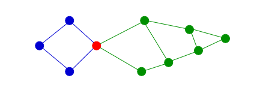
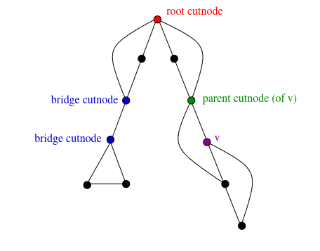
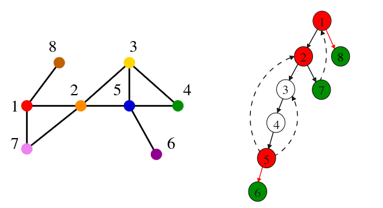
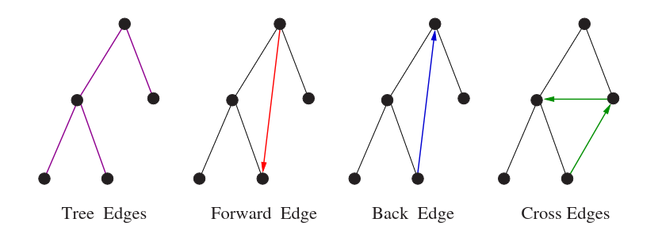

# 5.6 Applications of BFS and DFS

Many elementary graph algorithms are nothing more than a single traversal with carefully chosen hook functions. Since BFS and DFS both run in Θ(n + m) — optimal for reading any graph — any algorithm that reduces to one or two traversals is guaranteed to be linear. The art is recognising when a problem admits such a reduction.

This section covers the most important applications, grouped by which traversal strategy they rely on.

---

## BFS Applications

### Connected Components

A graph is **connected** if there is a path between every pair of vertices. A **connected component** is a maximal set of vertices with this property — a separate "island" of the graph with no edges crossing to any other island.

Finding connected components with BFS is straightforward: run a BFS from any undiscovered vertex, label everything it reaches as one component, then repeat from the next undiscovered vertex. Each fresh BFS call identifies a new component.

```c
void connected_components(graph *g) {
    int c = 0;
    initialize_search(g);
    for (int i = 1; i <= g->nvertices; i++) {
        if (!discovered[i]) {
            c++;
            printf("Component %d:", c);
            bfs(g, i);
            printf("\n");
        }
    }
}

void process_vertex_early(int v) { printf(" %d", v); }
void process_edge(int x, int y) { }
```

The counter `c` increments with each call to `bfs`. Alternatively, `process_vertex_early` could record a component ID per vertex rather than printing — allowing downstream queries like "are u and v in the same component?" in O(1).

An enormous number of seemingly unrelated problems reduce to connected components. Deciding whether a puzzle configuration (Rubik's cube, 15-puzzle) is solvable from any starting state is really asking whether the graph of all possible configurations is connected.


For **directed graphs**, connectivity splits into two distinct notions. A directed graph is **weakly connected** if the underlying undirected graph is connected. It is **strongly connected** if every vertex can reach every other vertex following directed edges. Both can be found in O(n + m) — strongly connected components are covered in Chapter 6.


---

## DFS Applications

The correctness of DFS-based algorithms depends critically on *when* hook functions fire. The three-hook model — `process_vertex_early`, `process_edge`, and `process_vertex_late` — gives precise control:

- **Early** fires before any outgoing edge of v is examined.
- **Edge** fires once per edge, the first time it is encountered.
- **Late** fires after *all* descendants of v have been fully explored.

For undirected graphs, each edge (x, y) appears in two adjacency lists and could be processed twice. The first time is when one endpoint is being explored and the other is undiscovered — this is when the edge is classified as a tree edge. Subsequent encounters must be handled carefully. When we see edge (x, y) from x and y is already discovered, we need to know: is this the first or second traversal? If `parent[x] == y`, then (y, x) was the tree edge that discovered x — this is the second traversal. Otherwise it is genuinely a back edge seen for the first time.

---

### Cycle Detection

Back edges are the signature of cycles. A graph with no back edges is a tree, and trees are acyclic. Any back edge from x to an ancestor y, combined with the tree path from y down to x, forms a cycle.

Detection is a single line in `process_edge`: if we encounter an edge (x, y) and y is not the parent of x but is already discovered, we have found a back edge and therefore a cycle.



```c
void process_edge(int x, int y) {
    if (parent[y] != x) {   /* back edge — not the tree edge that found x */
        printf("Cycle from %d to %d:", y, x);
        find_path(y, x, parent);
        finished = true;    /* stop after first cycle */
    }
}
```



```cpp
void process_edge(int x, int y) {
    if (parent[y] != x) {
        std::cout << "Cycle from " << y << " to " << x << ": ";
        find_path(y, x, parent);
        finished = true;
    }
}
```



```python
def process_edge(x, y):
    global finished
    if parent[y] != x:
        print(f"Cycle from {y} to {x}: ", end='')
        find_path(y, x, parent)
        finished = True
```



The `finished` flag terminates the DFS after the first cycle is found. Without it, DFS would report a new cycle for every back edge — a complete graph on n vertices has Θ(n²) such edges.

---

### Articulation Vertices

An **articulation vertex** (or *cut-node*) is a vertex whose removal disconnects the graph. Graphs containing one are inherently fragile — a single point of failure can split the network.



**Skiena Figure 7.11:** An articulation vertex is the weakest point in the graph — removing it splits one connected component into two or more.


Brute force works but is slow: delete each vertex in turn, re-run BFS, check connectivity. That costs O(n(n + m)). DFS finds all articulation vertices in a single O(n + m) pass.

The key insight comes from thinking about back edges as **security cables**. A back edge from descendant x up to ancestor y means that none of the vertices on the tree path between x and y can be cut-nodes — even if a vertex on that path is deleted, the security cable still holds the subtree connected to the rest of the tree.

A vertex v is an articulation vertex in exactly three cases:



**Skiena Figure 7.13:** The three cases: root cut-nodes (multiple children in DFS tree), bridge cut-nodes (no back edge bypasses the edge above v), and parent cut-nodes (earliest reachable ancestor from v is v's parent).


- **Root cut-node** — the root of the DFS tree has two or more children. No edge can cross between different subtrees of the root, so removing the root disconnects them.
- **Bridge cut-node** — the earliest ancestor reachable from v (via any back edge in v's subtree) is v itself. This means the edge (parent[v], v) is a **bridge** — its deletion disconnects v's subtree from the rest. Both parent[v] and v (if not a leaf) are articulation vertices.
- **Parent cut-node** — the earliest reachable ancestor from v is exactly parent[v]. Deleting parent[v] severs v from above, since no back edge from v's subtree reaches higher than parent[v].



**Skiena Figure 7.12:** DFS tree of a graph containing three articulation vertices (1, 2, and 5). Back edges protect vertices 3 and 4 from being cut-nodes. Leaf vertices 6, 7, and 8 are safe because removing a leaf disconnects nothing. Red edges are bridges.


The implementation tracks `reachable_ancestor[v]` — the oldest ancestor reachable from any vertex in v's subtree via a back edge. It is updated in `process_edge` whenever a back edge reaches an ancestor older than the current best:

```c
int reachable_ancestor[MAXV + 1];
int tree_out_degree[MAXV + 1];

void process_vertex_early(int v) {
    reachable_ancestor[v] = v;  /* initially, can only reach yourself */
}

void process_edge(int x, int y) {
    int class = edge_classification(x, y);

    if (class == TREE)
        tree_out_degree[x]++;

    if (class == BACK && parent[x] != y)
        if (entry_time[y] < entry_time[reachable_ancestor[x]])
            reachable_ancestor[x] = y;
}
```

The three cases are evaluated in `process_vertex_late`, which fires only after all of v's descendants are fully explored — the precise moment when `reachable_ancestor[v]` is finalised:

```c
void process_vertex_late(int v) {
    int time_v, time_parent;

    if (parent[v] == -1) {          /* v is the root */
        if (tree_out_degree[v] > 1)
            printf("root articulation vertex: %d\n", v);
        return;
    }

    bool root = (parent[parent[v]] == -1);

    if (!root) {
        if (reachable_ancestor[v] == parent[v])
            printf("parent articulation vertex: %d\n", parent[v]);

        if (reachable_ancestor[v] == v) {
            printf("bridge articulation vertex: %d\n", parent[v]);
            if (tree_out_degree[v] > 0)
                printf("bridge articulation vertex: %d\n", v);
        }
    }

    /* propagate reachability upward to parent */
    time_v      = entry_time[reachable_ancestor[v]];
    time_parent = entry_time[reachable_ancestor[parent[v]]];
    if (time_v < time_parent)
        reachable_ancestor[parent[v]] = reachable_ancestor[v];
}
```

The final lines propagate reachability upward: if v can reach an ancestor older than what parent[v] currently knows about, that information is passed up the tree.

---

### Edge Classification

DFS classifies every edge it encounters into one of four types. For undirected graphs only the first two arise; all four are possible in directed graphs.



**Skiena Figure 7.14:** Tree edges discover new vertices. Back edges point to ancestors. Forward edges point to descendants already in the tree. Cross edges connect vertices with no ancestor–descendant relationship. Forward and cross edges appear only in directed graphs.


| Edge type | When it occurs | Directed only? |
|---|---|---|
| **Tree edge** | (x, y) and y is undiscovered | No |
| **Back edge** | (x, y) and y is a proper ancestor of x | No |
| **Forward edge** | (x, y) and y is a descendant of x, already processed | Yes |
| **Cross edge** | (x, y) and y has no ancestor–descendant relation to x | Yes |

The entry and exit times from Section 5.5 give a clean test. If y's interval contains x's interval, the edge is a forward edge (ancestor to descendant). If x's interval contains y's, it is a back edge. Otherwise it is a cross edge.

Edge classification is not merely academic — it underpins the correctness of cycle detection, topological sorting, and strongly connected component algorithms. Back edges mean cycles; their absence means the graph is a DAG.


**Take-Home Lesson:** DFS-based algorithms are deceptively subtle. The same traversal framework handles cycle detection, articulation vertices, bridge finding, and topological sorting — but only because the hook functions fire at precisely the right moments. `process_vertex_late` in particular is powerful: it fires only after an entire subtree has been explored, which is exactly when structural properties of that subtree become knowable.
