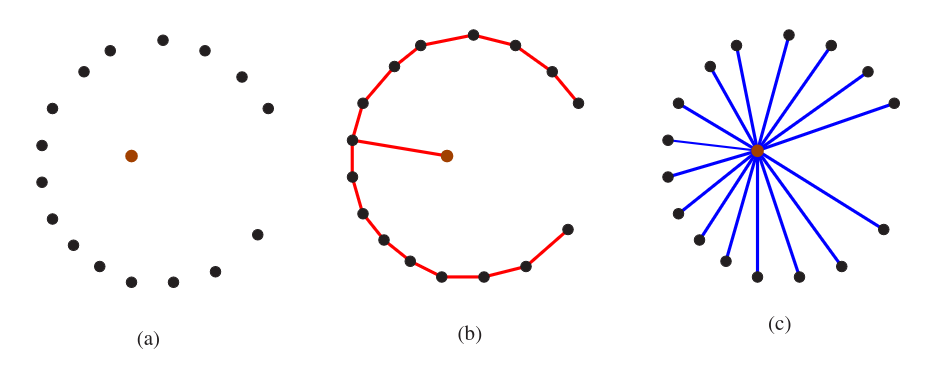
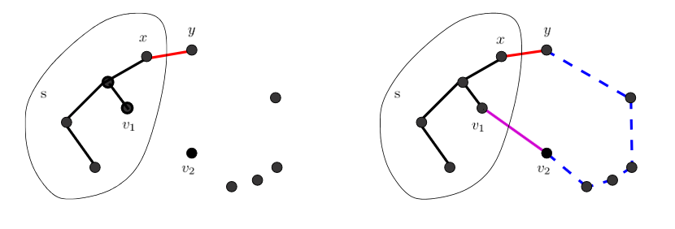
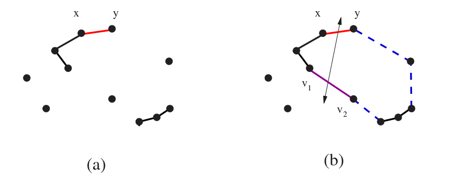
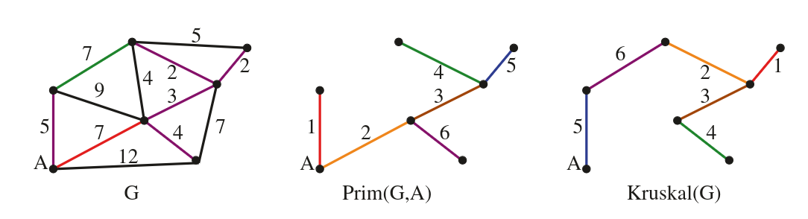

# 5.7 Minimum Spanning Trees

A **spanning tree** of a connected graph G = (V, E) is a subset of edges that forms a tree connecting all vertices. For weighted graphs, we want the **minimum spanning tree (MST)** — the spanning tree whose total edge weight is as small as possible.

MSTs appear whenever we need to connect a set of points as cheaply as possible: laying cable between cities, routing pipes between junctions, wiring components on a circuit board. Any tree on n vertices uses exactly n − 1 edges — the fewest possible for connectivity — but the MST is the lightest such tree by total weight.



**Skiena Figure 8.1:** A geometric MST on a point set. Edge weights are Euclidean distances; the MST connects all points using the minimum total length of wire.


There can be more than one MST for a given graph — all spanning trees of an equally-weighted graph are minimum spanning trees. Two different greedy algorithms find the MST, and both are provably correct.

---

## Prim's Algorithm

Prim's algorithm grows the MST one vertex at a time. Starting from an arbitrary vertex, it repeatedly adds the cheapest edge that connects a vertex already in the tree to a vertex not yet in the tree.

```
Prim-MST(G):
  Select an arbitrary start vertex s
  While there are non-tree vertices:
    Find the minimum-weight edge between a tree and non-tree vertex
    Add that edge and vertex to the tree
```

### Why Is It Correct?

The argument is by contradiction. Suppose Prim's algorithm made a fatal mistake by selecting edge (x, y) instead of some edge in the true MST. Before this choice, the partial tree was a subtree of some valid MST. After inserting (x, y), there must be an alternative path from x to y in the true MST using some other edge (v₁, v₂) — where v₁ is in the tree and v₂ is not.

But if (v₁, v₂) were cheaper than (x, y), Prim's algorithm would have selected it first. So weight(v₁, v₂) ≥ weight(x, y). Swapping (v₁, v₂) for (x, y) in the true MST yields a spanning tree no heavier than before — meaning Prim's choice was not a mistake.



**Skiena Figure 8.2:** Prim's algorithm cannot go wrong. Choosing (x, y) before (v₁, v₂) implies weight(v₁, v₂) ≥ weight(x, y), so the swap cannot make things worse.


### Implementation

The naive approach searches all m edges at every iteration — O(mn). The smarter approach maintains a `distance` array recording the cheapest known edge from each non-tree vertex into the current tree. Only the newly added vertex's outgoing edges can change these distances, so each iteration does at most O(n) work — giving O(n²) overall.



```c
int prim(graph *g, int start) {
    bool intree[MAXV + 1];
    int  distance[MAXV + 1];
    int  v, w, weight = 0;
    int  dist;
    edgenode *p;

    for (int i = 1; i <= g->nvertices; i++) {
        intree[i]   = false;
        distance[i] = MAXINT;
        parent[i]   = -1;
    }

    distance[start] = 0;
    v = start;

    while (!intree[v]) {
        intree[v] = true;
        if (v != start) {
            printf("edge (%d,%d) in MST\n", parent[v], v);
            weight += dist;
        }

        p = g->edges[v];
        while (p != NULL) {
            w = p->y;
            if ((distance[w] > p->weight) && (!intree[w])) {
                distance[w] = p->weight;
                parent[w]   = v;
            }
            p = p->next;
        }

        dist = MAXINT;
        for (int i = 1; i <= g->nvertices; i++) {
            if (!intree[i] && dist > distance[i]) {
                dist = distance[i];
                v    = i;
            }
        }
    }
    return weight;
}
```



```cpp
int prim(const Graph &g, int start) {
    std::vector<bool> intree(g.nvertices + 1, false);
    std::vector<int>  distance(g.nvertices + 1, INT_MAX);
    std::vector<int>  par(g.nvertices + 1, -1);
    int weight = 0;

    distance[start] = 0;
    int v = start;

    while (!intree[v]) {
        intree[v] = true;
        if (v != start) {
            std::cout << "edge (" << par[v] << "," << v << ") in MST\n";
            weight += distance[v];
        }

        for (const auto &e : g.edges[v]) {
            int w = e.y;
            if (!intree[w] && distance[w] > e.weight) {
                distance[w] = e.weight;
                par[w]      = v;
            }
        }

        int dist = INT_MAX;
        for (int i = 1; i <= g.nvertices; i++) {
            if (!intree[i] && distance[i] < dist) {
                dist = distance[i];
                v    = i;
            }
        }
    }
    return weight;
}
```



```python
import math

def prim(g, start):
    intree   = {i: False    for i in range(1, g.nvertices + 1)}
    distance = {i: math.inf for i in range(1, g.nvertices + 1)}
    parent   = {i: -1       for i in range(1, g.nvertices + 1)}
    weight   = 0

    distance[start] = 0
    v = start

    while not intree[v]:
        intree[v] = True
        if v != start:
            print(f"edge ({parent[v]},{v}) in MST")
            weight += distance[v]

        node = g.edges[v]
        while node:
            w = node.y
            if not intree[w] and distance[w] > node.weight:
                distance[w] = node.weight
                parent[w]   = v
            node = node.next

        # find cheapest non-tree vertex
        v = min(
            (i for i in range(1, g.nvertices + 1) if not intree[i]),
            key=lambda i: distance[i],
            default=None
        )
        if v is None:
            break

    return weight
```



### Complexity

| Implementation | Time |
|---|---|
| Naive (scan all edges each iteration) | O(mn) |
| Smart (distance array, scan vertices) | O(n²) |
| Priority queue (min-heap) | O(m + n log n) |

The O(n²) implementation above is appropriate for dense graphs where m ≈ n². For sparse graphs, a priority queue reduces the bottleneck from scanning all vertices to extracting the minimum efficiently.

---

## Kruskal's Algorithm

Kruskal's algorithm takes a different approach: rather than growing a single tree from a root, it builds up **connected components** that eventually merge into the MST. It considers edges globally in order of increasing weight, adding each one that connects two previously separate components.

```
Kruskal-MST(G):
  Sort all edges by weight (ascending)
  Initialise each vertex as its own component
  count = 0
  For each edge (v, w) in sorted order:
    If v and w are in different components:
      Add (v, w) to MST
      Merge the two components
      count++
    Stop when count == n − 1
```

Since we always merge separate components (never add an edge within one), no cycle is ever created. After n − 1 insertions, all vertices are connected — a spanning tree exists.

### Why Is It Correct?

Suppose Kruskal's first fatal mistake was inserting edge (x, y). In the true MST, x and y are connected by some path. Since x and y were in different components when (x, y) was considered, at least one edge (v₁, v₂) on that path must have been evaluated later — meaning weight(v₁, v₂) ≥ weight(x, y). Swapping (v₁, v₂) for (x, y) yields a tree no heavier than the supposed MST. No mistake was made.



**Skiena Figure 8.4:** Kruskal cannot go wrong. Edge (v₁, v₂), added after (x, y), must be at least as heavy — so the swap cannot increase total weight.


### Implementation

The implementation requires two supporting structures: an edge array (to sort all edges by weight) and a **union-find** structure (to test and merge components efficiently). Union-find supports both operations in O(log n), bringing the total complexity to O(m log m) — dominated by the initial sort.



```c
int kruskal(graph *g) {
    union_find s;
    edge_pair  e[MAXV + 1];
    int weight = 0;

    union_find_init(&s, g->nvertices);
    to_edge_array(g, e);
    qsort(e, g->nedges, sizeof(edge_pair), &weight_compare);

    for (int i = 0; i < g->nedges; i++) {
        if (!same_component(&s, e[i].x, e[i].y)) {
            printf("edge (%d,%d) in MST\n", e[i].x, e[i].y);
            weight += e[i].weight;
            union_sets(&s, e[i].x, e[i].y);
        }
    }
    return weight;
}
```



```cpp
struct EdgePair {
    int x, y, weight;
};

// Simple union-find
struct UnionFind {
    std::vector<int> parent, rank;
    UnionFind(int n) : parent(n + 1), rank(n + 1, 0) {
        std::iota(parent.begin(), parent.end(), 0);
    }
    int find(int x) {
        return parent[x] == x ? x : parent[x] = find(parent[x]);
    }
    bool same(int x, int y) { return find(x) == find(y); }
    void unite(int x, int y) {
        x = find(x); y = find(y);
        if (rank[x] < rank[y]) std::swap(x, y);
        parent[y] = x;
        if (rank[x] == rank[y]) rank[x]++;
    }
};

int kruskal(const Graph &g) {
    std::vector<EdgePair> edges;
    for (int v = 1; v <= g.nvertices; v++)
        for (const auto &e : g.edges[v])
            if (v < e.y)   /* avoid duplicate undirected edges */
                edges.push_back({v, e.y, e.weight});

    std::sort(edges.begin(), edges.end(),
              [](const EdgePair &a, const EdgePair &b) {
                  return a.weight < b.weight;
              });

    UnionFind uf(g.nvertices);
    int weight = 0;

    for (const auto &e : edges) {
        if (!uf.same(e.x, e.y)) {
            std::cout << "edge (" << e.x << "," << e.y << ") in MST\n";
            weight += e.weight;
            uf.unite(e.x, e.y);
        }
    }
    return weight;
}
```



```python
class UnionFind:
    def __init__(self, n):
        self.parent = list(range(n + 1))
        self.rank   = [0] * (n + 1)

    def find(self, x):
        if self.parent[x] != x:
            self.parent[x] = self.find(self.parent[x])
        return self.parent[x]

    def same(self, x, y):
        return self.find(x) == self.find(y)

    def unite(self, x, y):
        x, y = self.find(x), self.find(y)
        if self.rank[x] < self.rank[y]:
            x, y = y, x
        self.parent[y] = x
        if self.rank[x] == self.rank[y]:
            self.rank[x] += 1


def kruskal(g):
    edges = []
    for v in range(1, g.nvertices + 1):
        node = g.edges[v]
        while node:
            if v < node.y:   # avoid duplicate undirected edges
                edges.append((node.weight, v, node.y))
            node = node.next

    edges.sort()
    uf     = UnionFind(g.nvertices)
    weight = 0

    for w, x, y in edges:
        if not uf.same(x, y):
            print(f"edge ({x},{y}) in MST")
            weight += w
            uf.unite(x, y)

    return weight
```



---

## Prim vs. Kruskal



**Skiena Figure 8.3:** The same graph G solved by Prim (centre) and Kruskal (right). Both produce a valid MST of equal weight, but may select different edges when weights are tied.


| Property | Prim | Kruskal |
|---|---|---|
| Strategy | Grow one tree from a root | Merge components globally |
| Edge processing | Cheapest edge touching the tree | Cheapest edge overall |
| Complexity (simple) | O(n²) | O(m log m) |
| Complexity (optimised) | O(m + n log n) | O(m log m) |
| Better when | Dense graphs (m ≈ n²) | Sparse graphs (m ≈ n) |
| Key data structure | Distance array / priority queue | Union-find |

Both algorithms are greedy and both are correct. The choice between them is purely about the structure of the graph. For dense graphs, Prim's O(n²) implementation is competitive since m and n² are similar in size. For sparse graphs, Kruskal's sort-and-merge approach wins because m log m is much smaller than n².


**Take-Home Lesson:** Both Prim's and Kruskal's algorithms are greedy — they make the locally cheapest choice at every step. That greedy choices produce a globally optimal MST is not obvious and must be proved. The proof in both cases follows the same structure: any deviation from the greedy choice can be corrected by a swap that does not increase the total weight.

