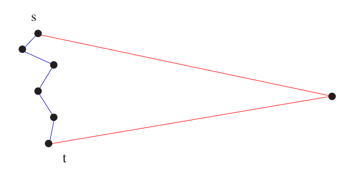

# 5.8 Shortest Paths

A **path** is a sequence of edges connecting two vertices. In any real network — road maps, social graphs, communication networks — there are typically an enormous number of paths between any two vertices. The **shortest path** is the one that minimises the total sum of edge weights, reflecting the fastest route, the cheapest connection, or the closest relationship.

For unweighted graphs, BFS already solves this problem (Section 5.4) — the BFS tree records minimum-hop paths from the source. But BFS fails for weighted graphs. The fewest-edge path is not necessarily the lowest-weight path; a fastest route between two cities may involve many intermediate stops on fast roads, rather than a direct but slow one.



**Skiena Figure 8.7:** The shortest path from s to t may pass through many intermediate vertices rather than taking the fewest possible edges.


---

## Dijkstra's Algorithm

Dijkstra's algorithm finds the shortest path from a source vertex s to **all other vertices** in a weighted graph with non-negative edge weights. It proceeds in rounds, each round permanently settling the shortest distance to one new vertex.

### The Core Idea

Suppose the shortest path from s to t passes through intermediate vertex x. Then the prefix of that path — from s to x — must itself be the shortest path from s to x. If it weren't, we could substitute a shorter s-to-x path and improve the overall route. This prefix-optimality property is what makes a greedy, round-by-round approach correct.

At each round, Dijkstra selects the unsettled vertex v that minimises:

```
dist[s] + w(s → ... → v)
```

Once v is settled, its outgoing edges are relaxed — checking whether reaching any neighbour w *through* v is cheaper than the best known path to w so far.

### Algorithm

```
Dijkstra(G, s):
  dist[s] = 0
  dist[v] = ∞  for all other v
  known   = {}

  while unknown vertices remain:
    v = unsettled vertex with minimum dist[v]
    mark v as settled
    for each edge (v, w):
      if dist[v] + weight(v, w) < dist[w]:
        dist[w] = dist[v] + weight(v, w)
        parent[w] = v
```

### Prim vs. Dijkstra

Dijkstra's algorithm is structurally identical to Prim's — the only difference is how edge desirability is scored:

| Algorithm | Selects next vertex by |
|---|---|
| Prim | Minimum weight of the *next edge alone* |
| Dijkstra | Minimum *total distance from source* through next edge |

In code, this is a change of exactly one condition. Where Prim updates `distance[w] = edge_weight`, Dijkstra updates `distance[w] = distance[v] + edge_weight`. Everything else — the `intree` array, the scan for minimum distance, the parent tracking — is identical.

### Implementation



```c
int dijkstra(graph *g, int start) {
    bool intree[MAXV + 1];
    int  distance[MAXV + 1];
    int  v, w, weight = 0;
    int  dist;
    edgenode *p;

    for (int i = 1; i <= g->nvertices; i++) {
        intree[i]   = false;
        distance[i] = MAXINT;
        parent[i]   = -1;
    }

    distance[start] = 0;
    v = start;

    while (!intree[v]) {
        intree[v] = true;
        if (v != start) {
            printf("edge (%d,%d) in tree\n", parent[v], v);
            weight += dist;
        }

        p = g->edges[v];
        while (p != NULL) {
            w = p->y;
            if (distance[w] > (distance[v] + p->weight)) {  /* Dijkstra line */
                distance[w] = distance[v] + p->weight;
                parent[w]   = v;
            }
            p = p->next;
        }

        dist = MAXINT;
        for (int i = 1; i <= g->nvertices; i++) {
            if (!intree[i] && dist > distance[i]) {
                dist = distance[i];
                v    = i;
            }
        }
    }
    return weight;
}
```



```cpp
int dijkstra(const Graph &g, int start) {
    std::vector<bool> intree(g.nvertices + 1, false);
    std::vector<int>  distance(g.nvertices + 1, INT_MAX);
    std::vector<int>  par(g.nvertices + 1, -1);
    int weight = 0;

    distance[start] = 0;
    int v = start;

    while (!intree[v]) {
        intree[v] = true;
        if (v != start) {
            std::cout << "edge (" << par[v] << "," << v << ") in tree\n";
            weight += distance[v];
        }

        for (const auto &e : g.edges[v]) {
            int w = e.y;
            if (!intree[w] && distance[w] > distance[v] + e.weight) {  /* Dijkstra line */
                distance[w] = distance[v] + e.weight;
                par[w]      = v;
            }
        }

        int dist = INT_MAX;
        for (int i = 1; i <= g.nvertices; i++) {
            if (!intree[i] && distance[i] < dist) {
                dist = distance[i];
                v    = i;
            }
        }
    }
    return weight;
}
```



```python
import math

def dijkstra(g, start):
    intree   = {i: False    for i in range(1, g.nvertices + 1)}
    distance = {i: math.inf for i in range(1, g.nvertices + 1)}
    parent   = {i: -1       for i in range(1, g.nvertices + 1)}
    weight   = 0

    distance[start] = 0
    v = start

    while not intree[v]:
        intree[v] = True
        if v != start:
            print(f"edge ({parent[v]},{v}) in tree")
            weight += distance[v]

        node = g.edges[v]
        while node:
            w = node.y
            if not intree[w] and distance[w] > distance[v] + node.weight:  # Dijkstra line
                distance[w] = distance[v] + node.weight
                parent[w]   = v
            node = node.next

        # select next unsettled vertex with minimum distance
        v = min(
            (i for i in range(1, g.nvertices + 1) if not intree[i]),
            key=lambda i: distance[i],
            default=None
        )
        if v is None:
            break

    return weight, distance, parent
```



### Recovering the Path

The `parent` array encodes the shortest-path tree rooted at `start`. To recover the actual path to any vertex t, follow parent pointers backward from t to the source — exactly as in BFS path recovery (Section 5.4):



```c
void find_path(int start, int end, int parents[]) {
    if ((start == end) || (end == -1))
        printf("\n%d", start);
    else {
        find_path(start, parents[end], parents);
        printf(" %d", end);
    }
}
```



```cpp
void find_path(int start, int end, const std::vector<int> &parents) {
    if (start == end || end == -1)
        std::cout << "\n" << start;
    else {
        find_path(start, parents[end], parents);
        std::cout << " " << end;
    }
}
```



```python
def find_path(start, end, parents):
    if start == end or end == -1:
        print(start, end=' ')
    else:
        find_path(start, parents[end], parents)
        print(end, end=' ')
```



The value `distance[t]` gives the total weight of the shortest path. If `distance[t]` remains ∞ after the algorithm completes, no path from `start` to t exists.

---

## Complexity

| Implementation | Time |
|---|---|
| Simple scan (as above) | O(n²) |
| Binary heap priority queue | O((n + m) log n) |
| Fibonacci heap | O(m + n log n) |

The O(n²) implementation is appropriate for dense graphs. For sparse graphs, replacing the linear scan for the minimum-distance vertex with a priority queue reduces the bottleneck significantly.

---

## Limitations: Negative Edge Weights

Dijkstra's algorithm is correct **only when all edge weights are non-negative**. The greedy argument breaks down with negative weights: once a vertex is settled, Dijkstra assumes no cheaper path to it can be found later. A sufficiently negative edge discovered afterwards could invalidate that assumption.

Concretely: if following a negative-weight edge back to an already-settled vertex would reduce its distance, Dijkstra misses it entirely. This is not a fixable implementation detail — it is a fundamental limitation of the greedy settling strategy.


Negative edge weights are rare in practice — road distances, communication costs, and travel times are all non-negative. But if your graph may contain negative weights, Dijkstra's algorithm is not safe to use. The Bellman-Ford algorithm handles negative weights correctly in O(mn), at the cost of being slower.


---

## Vertex-Weighted Graphs

A natural extension is graphs where costs are on **vertices** rather than edges — the cost of a path is the sum of vertex weights along it, not edge weights.

The cleanest solution is not to modify Dijkstra's algorithm but to **transform the graph**. Set the weight of each directed edge (i, j) to the weight of the destination vertex j. Dijkstra then runs unchanged on this edge-weighted graph and produces correct shortest paths on the original vertex-weighted one.

This is a recurring principle in algorithm design: rather than building a specialised algorithm for every problem variant, transform the input so that a known algorithm applies directly.


**Take-Home Lesson:** Dijkstra's algorithm is Prim's algorithm with one line changed. Both are greedy, both run in O(n²) with a simple implementation, and both can be accelerated with a priority queue. The conceptual gap between minimum spanning trees and shortest paths is smaller than it first appears — the difference is entirely in how you score the desirability of the next vertex to add.

