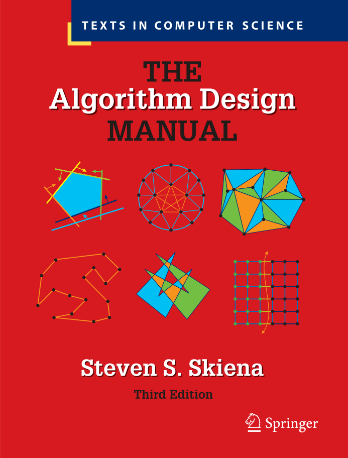
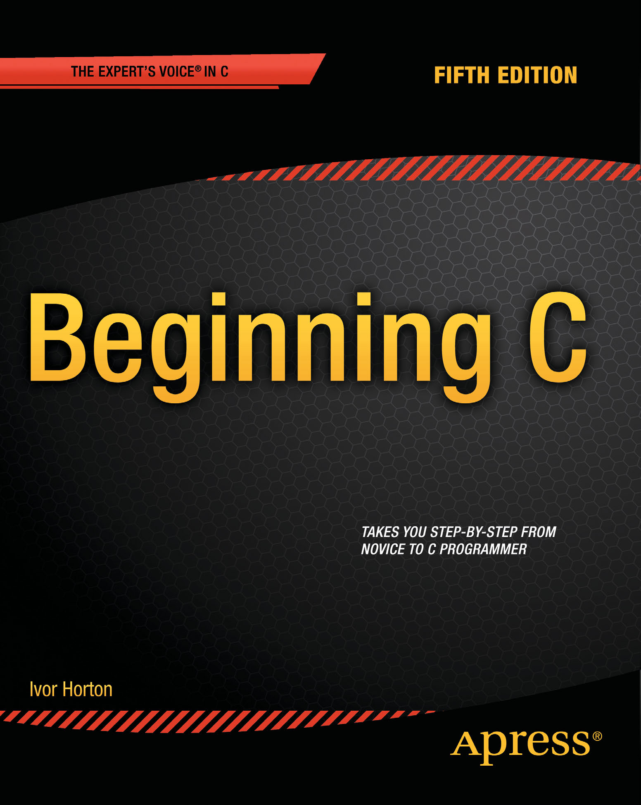

# Prescribed Resources

Effective algorithm design requires both a solid theoretical foundation and practical "war stories." These are the books that will guide you.

---

## Primary Textbook

| | |
| :--- | :--- |
|  | ### The Algorithm Design Manual   **Author**: Steven S. Skiena \| **Edition**: 3rd Edition    This is your main textbook. Skiena’s approach is famous for being "practitioner-first."    **Why we use it:** <ul><li>**War Stories:** Real-world examples.</li><li>**The Hitchhiker's Guide:** A catalog of problems.</li></ul> |

---

## Reference Resource

| | |
| :--- | :--- |
|  | ### Beginning C   **Author**: Ivor Horton \| **Edition**: 2013    Although we have moved to Python, this is a high-quality reference for low-level implementation. |
---

## Study Mapping

| Study Unit | Skiena Chapters | Topics Covered |
| :--- | :--- | :--- |
| **Unit 1** | *TBA* | *Coming soon* |
| **Unit 2** | *TBA* | *Coming soon* |
| **Unit 3** | *TBA* | *Coming soon* |
| **Unit 4** | *TBA* | *Coming soon* |
| **Unit 5** | *TBA* | *Coming soon* |

---


**Ready to get your environment ready?**
[Set up your IDE (PyCharm or VSCode) →](ide-setup/)
